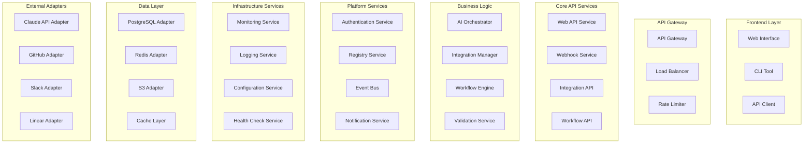

# 🧩 Компоненты системы Claude Code Bot

## Обзор компонентов

Система Claude Code Bot состоит из множества взаимосвязанных компонентов, каждый из которых выполняет специфические функции. Все компоненты спроектированы по принципу единственной ответственности и слабой связанности.

## Диаграмма компонентов



## Детальное описание компонентов

### Frontend Layer (Фронтенд слой)

#### Web Interface

**Назначение:** Веб-интерфейс для управления интеграциями и мониторинга.

**Технические детали:**

- Framework: React + TypeScript
- State Management: Redux Toolkit
- UI Components: Material-UI
- Build Tool: Vite

**Функции:**

- Dashboard с метриками интеграций
- Визуальный конструктор workflow
- Управление настройками интеграций
- Мониторинг статуса и логов
- Пользовательские профили и настройки

#### CLI Tool

**Назначение:** Инструмент командной строки для разработчиков.

**Технические детали:**

- Language: Python 3.12
- Framework: Typer
- Configuration: YAML/TOML
- Package Manager: uv

**Команды:**

```bash
ccb init              # Инициализация проекта
ccb deploy <name>      # Развертывание интеграции
ccb logs <name>        # Просмотр логов
ccb test <name>        # Тестирование интеграции
ccb list               # Список интеграций
ccb status <name>      # Статус интеграции
```

#### API Client

**Назначение:** SDK для интеграции с Claude Code Bot из других приложений.

**Технические детали:**

- Languages: Python, TypeScript, Go
- Authentication: JWT + API Keys
- HTTP Client: Requests (Python), Axios (TS)
- Error Handling: Structured exceptions

### API Gateway Layer

#### API Gateway

**Назначение:** Единая точка входа для всех API запросов.

**Технические детали:**

- Technology: Kong или Envoy Proxy
- Protocol Support: HTTP/1.1, HTTP/2, gRPC
- Authentication: JWT, OAuth 2.0, API Keys
- Rate Limiting: Token bucket algorithm

**Функции:**

- Request routing и load balancing
- Authentication и authorization
- Request/response transformation
- API versioning
- CORS handling
- SSL termination

#### Load Balancer

**Назначение:** Распределение нагрузки между инстансами сервисов.

**Алгоритмы балансировки:**

- Round Robin для равномерного распределения
- Least Connections для оптимизации
- IP Hash для session affinity
- Weighted Round Robin для различной производительности

#### Rate Limiter

**Назначение:** Защита от злоупотреблений и DDoS атак.

**Стратегии лимитирования:**

- Per-user limits: 1000 req/hour
- Per-IP limits: 100 req/minute
- Global limits: 10000 req/minute
- Burst limits: 50 req/second

### Core API Services

#### Web API Service

**Назначение:** Основной REST API для взаимодействия с клиентами.

**Технические детали:**

- Framework: FastAPI
- Validation: Pydantic
- Documentation: OpenAPI 3.0
- Testing: pytest + httpx

**Endpoints:**

```sql
GET    /api/v1/integrations           # Список интеграций
POST   /api/v1/integrations           # Создание интеграции
GET    /api/v1/integrations/{id}      # Детали интеграции
PUT    /api/v1/integrations/{id}      # Обновление интеграции
DELETE /api/v1/integrations/{id}      # Удаление интеграции
POST   /api/v1/integrations/{id}/test # Тестирование интеграции
```

#### Webhook Service

**Назначение:** Обработка входящих webhook'ов от внешних сервисов.

**Поддерживаемые источники:**

- GitHub (push, pull_request, issues)
- Slack (slash commands, events)
- Linear (issue updates, project changes)
- Jira (issue transitions, comments)

**Обработка:**

- Signature verification
- Payload validation
- Event transformation
- Asynchronous processing
- Retry mechanism

#### Integration API

**Назначение:** Специализированный API для управления интеграциями.

**Функции:**

- CRUD операции для интеграций
- Версионирование интеграций
- Dependency management
- Health checking
- Performance metrics

#### Workflow API

**Назначение:** API для создания и управления workflow'ами.

**Capabilities:**

- Workflow definition (YAML/JSON)
- Execution management
- State monitoring
- Error handling
- Rollback operations

### Business Logic Layer

#### AI Orchestrator

**Назначение:** Центральный компонент для взаимодействия с Claude API.

**Архитектура:**

```text
┌─────────────────┐
│   Request       │
│   Preprocessor  │
└─────────────────┘
         │
┌─────────────────┐
│   Context       │
│   Builder       │
└─────────────────┘
         │
┌─────────────────┐
│   Claude API    │
│   Client        │
└─────────────────┘
         │
┌─────────────────┐
│   Response      │
│   Processor     │
└─────────────────┘
         │
┌─────────────────┐
│   Code          │
│   Validator     │
└─────────────────┘
```

**Компоненты:**

- **Request Preprocessor** — подготовка запроса
- **Context Builder** — формирование контекста
- **Claude API Client** — взаимодействие с API
- **Response Processor** — обработка ответа
- **Code Validator** — валидация кода

#### Integration Manager

**Назначение:** Управление полным жизненным циклом интеграций.

**Состояния интеграции:**

```text
[REQUESTED] → [ANALYZING] → [GENERATING] → [TESTING] → [REVIEWING] → [DEPLOYING] → [ACTIVE]
     │              │            │           │            │            │
     ↓              ↓            ↓           ↓            ↓            ↓
   [FAILED]      [FAILED]    [FAILED]    [FAILED]    [FAILED]    [FAILED]
```

**Операции:**

- Create integration from issue
- Update integration code
- Version management
- Deployment orchestration
- Health monitoring
- Deprecation handling

#### Workflow Engine

**Назначение:** Выполнение автоматизированных процессов.

**Типы workflow:**

- **Integration Creation** — создание новой интеграции
- **Integration Update** — обновление существующей
- **Testing Pipeline** — автоматическое тестирование
- **Deployment Process** — развертывание в production

**Execution Model:**

- Step-by-step execution
- Parallel execution для независимых задач
- Conditional branching
- Error handling и compensation
- Progress tracking

#### Validation Service

**Назначение:** Валидация кода, конфигураций и данных.

**Типы валидации:**

- **Syntax Validation** — синтаксическая корректность
- **Type Checking** — статическая типизация
- **Security Scan** — поиск уязвимостей
- **Performance Analysis** — анализ производительности
- **Compliance Check** — соответствие стандартам

### Platform Services

#### Authentication Service

**Назначение:** Управление аутентификацией и авторизацией.

**Функции:**

- User registration и login
- JWT token management
- OAuth 2.0 integration
- Role-based access control
- Session management
- Multi-factor authentication

**Модель данных:**

```text
User {
  id: UUID
  email: string
  roles: Role[]
  organizations: Organization[]
  created_at: timestamp
  last_login: timestamp
}

Role {
  name: string
  permissions: Permission[]
}

Permission {
  resource: string
  action: string
  conditions?: Condition[]
}
```

#### Registry Service

**Назначение:** Каталог интеграций и сервисов.

**Функции:**

- Service discovery
- Integration metadata
- Version tracking
- Dependency management
- Health status
- Performance metrics

**Схема реестра:**

```yaml
integration:
  name: "github-integration"
  version: "1.2.0"
  description: "GitHub API integration"
  author: "Claude Code Bot"
  dependencies:
    - name: "requests"
      version: "^2.28.0"
  capabilities:
    - "repository.read"
    - "issues.write"
    - "webhooks.receive"
  health_check:
    endpoint: "/health"
    interval: "30s"
    timeout: "5s"
```

#### Event Bus

**Назначение:** Асинхронная коммуникация между компонентами.

**Технические детали:**

- Implementation: Redis Streams или Apache Kafka
- Message Format: JSON с schema validation
- Delivery Guarantees: At-least-once
- Ordering: Partial ordering по ключу

**Event Types:**

```typescript
interface IntegrationEvent {
  id: string
  type: 'integration.created' | 'integration.updated' | 'integration.failed'
  timestamp: string
  data: {
    integration_id: string
    user_id: string
    metadata: Record<string, any>
  }
}
```

#### Notification Service

**Назначение:** Отправка уведомлений пользователям.

**Каналы:**

- Email notifications
- Slack messages
- Discord webhooks
- In-app notifications
- SMS (критические алерты)

**Типы уведомлений:**

- Integration status updates
- Error notifications
- Performance alerts
- Security warnings
- Marketing communications

### Infrastructure Services

#### Monitoring Service

**Назначение:** Сбор метрик и состояния системы.

**Метрики:**

- **Business Metrics:** интеграции в минуту, успешность
- **System Metrics:** CPU, память, диск, сеть
- **Application Metrics:** latency, throughput, errors
- **Custom Metrics:** AI API usage, code quality

**Stack:**

- Prometheus для сбора метрик
- Grafana для визуализации
- AlertManager для алертинга
- Jaeger для трассировки

#### Logging Service

**Назначение:** Централизованное логирование.

**Структура логов:**

```json
{
  "timestamp": "2025-01-01T12:00:00Z",
  "level": "INFO",
  "service": "ai-orchestrator",
  "trace_id": "abc123",
  "span_id": "def456",
  "user_id": "user123",
  "message": "Integration generated successfully",
  "metadata": {
    "integration_id": "int456",
    "duration_ms": 5000
  }
}
```

**Log Levels:**

- ERROR: ошибки требующие внимания
- WARN: предупреждения о проблемах
- INFO: информационные сообщения
- DEBUG: детальная отладочная информация

#### Configuration Service

**Назначение:** Централизованное управление конфигурацией.

**Источники конфигурации:**

- Environment variables
- Configuration files (YAML/JSON)
- Database settings
- External config services (Consul, etcd)

**Категории настроек:**

- Database connections
- External API credentials
- Feature flags
- Rate limiting parameters
- Caching policies

#### Health Check Service

**Назначение:** Мониторинг состояния компонентов.

**Типы проверок:**

- **Liveness:** сервис работает
- **Readiness:** готов обрабатывать запросы
- **Startup:** завершена инициализация

**Health Check Endpoints:**

```text
GET /health          # Overall health
GET /health/live     # Liveness probe
GET /health/ready    # Readiness probe
GET /health/deps     # Dependencies status
```

### Data Layer

#### PostgreSQL Adapter

**Назначение:** Адаптер для работы с основной базой данных.

**Функции:**

- Connection pooling
- Query optimization
- Transaction management
- Schema migrations
- Backup и recovery

#### Redis Adapter

**Назначение:** Адаптер для кеширования и очередей.

**Использование:**

- Session storage
- Application caching
- Message queues
- Rate limiting counters
- Distributed locks

#### S3 Adapter

**Назначение:** Адаптер для объектного хранилища.

**Типы данных:**

- Generated code artifacts
- Log files
- Backup files
- Static assets
- Integration templates

#### Cache Layer

**Назначение:** Многоуровневое кеширование.

**Уровни кеширования:**

1. **L1 Cache:** In-memory (Redis)
2. **L2 Cache:** Application cache
3. **L3 Cache:** CDN cache
4. **Database Cache:** Query cache

### External Adapters

#### Claude API Adapter

**Назначение:** Интеграция с Claude API.

**Функции:**

- Authentication handling
- Request/response transformation
- Rate limiting compliance
- Error handling
- Streaming support

#### GitHub Adapter

**Назначение:** Интеграция с GitHub API.

**Возможности:**

- Repository operations
- Issue management
- Pull request handling
- Webhook processing
- App authentication

#### Slack Adapter

**Назначение:** Интеграция со Slack API.

**Функции:**

- Message sending
- Channel management
- Slash commands
- Interactive components
- Bot user management

#### Linear Adapter

**Назначение:** Интеграция с Linear API.

**Операции:**

- Issue CRUD operations
- Project management
- Team synchronization
- Webhook handling
- GraphQL queries

## Межкомпонентное взаимодействие

### Синхронные взаимодействия

- REST API calls для immediate responses
- gRPC для high-performance communication
- GraphQL для flexible data fetching

### Асинхронные взаимодействия

- Event publishing/subscribing
- Message queues для background processing
- Webhook callbacks для external notifications

### Паттерны коммуникации

#### Request-Response

Для операций требующих немедленного ответа:

```text
Client → API Gateway → Service → Database → Response
```

#### Event-Driven

Для асинхронных операций:

```text
Service A → Event Bus → Service B
                     → Service C
                     → Service D
```

#### Saga Pattern

Для distributed transactions:

```text
Orchestrator → Service A → Success → Service B → Success → Complete
                      ↓                     ↓
                   Failure              Failure
                      ↓                     ↓
                  Compensate A       Compensate B
```

## Заключение

Компонентная архитектура Claude Code Bot обеспечивает:

1. **Модульность** — каждый компонент имеет четкую ответственность
2. **Масштабируемость** — компоненты могут масштабироваться независимо
3. **Надежность** — отказ одного компонента не влияет на другие
4. **Maintainability** — легкость изменений и обновлений
5. **Testability** — каждый компонент может тестироваться изолированно

Эта архитектура позволяет системе эффективно обрабатывать сложные процессы создания интеграций при сохранении высокого качества и производительности.
