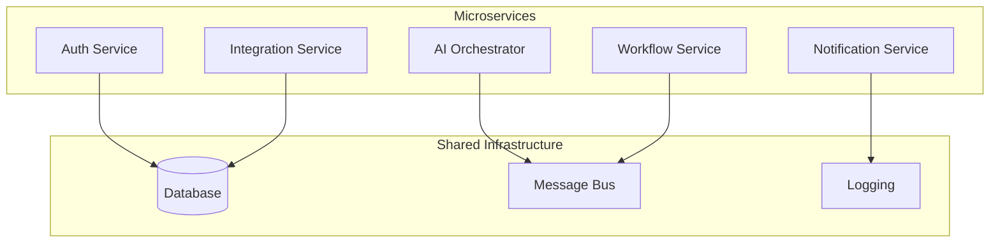
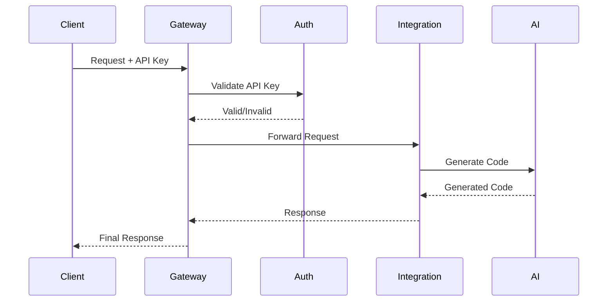
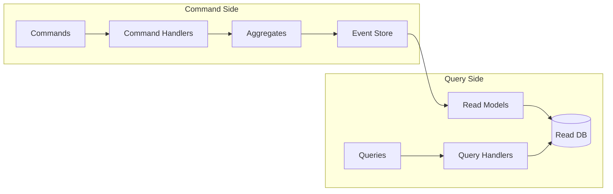
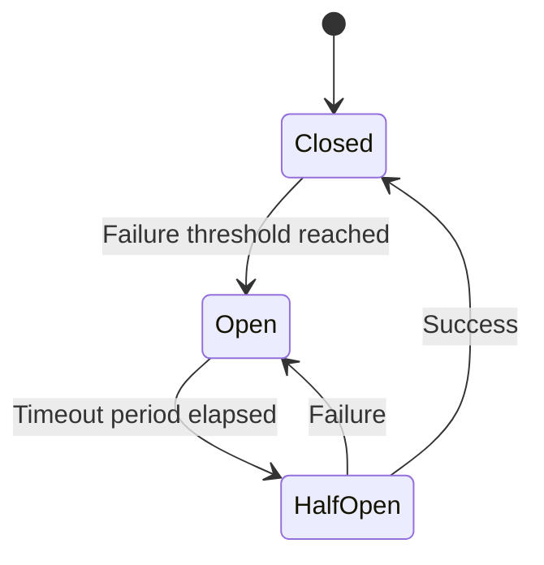
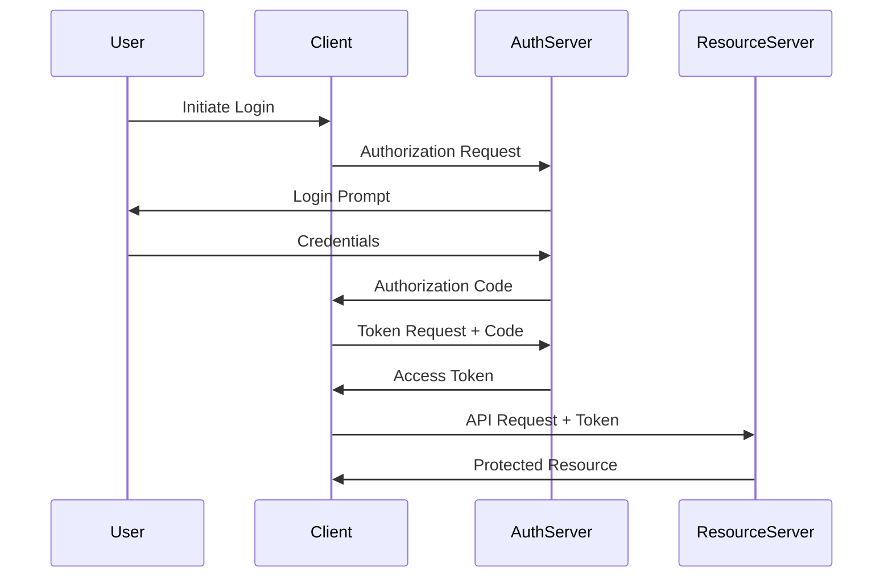

# 🏛️ Архитектурные паттерны Claude Code Bot

## Обзор паттернов

Claude Code Bot использует набор проверенных архитектурных паттернов для обеспечения надежности, масштабируемости и maintainability. Каждый паттерн решает специфические архитектурные проблемы и вместе они формируют cohesive систему.

## Категории паттернов

### 1. Структурные паттерны

- [Microservices](#microservices-pattern)
- [API Gateway](#api-gateway-pattern)
- [Service Mesh](#service-mesh-pattern)
- [Layered Architecture](#layered-architecture-pattern)

### 2. Поведенческие паттерны

- [Event Sourcing](#event-sourcing-pattern)
- [CQRS](#cqrs-pattern)
- [Saga](#saga-pattern)
- [State Machine](#state-machine-pattern)

### 3. Паттерны надежности

- [Circuit Breaker](#circuit-breaker-pattern)
- [Bulkhead](#bulkhead-pattern)
- [Retry](#retry-pattern)
- [Timeout](#timeout-pattern)

### 4. Паттерны производительности

- [Caching](#caching-patterns)
- [Connection Pooling](#connection-pooling-pattern)
- [Async Processing](#async-processing-pattern)
- [Load Balancing](#load-balancing-pattern)

### 5. Паттерны безопасности

- [OAuth 2.0](#oauth-20-pattern)
- [JWT Token](#jwt-token-pattern)
- [API Key](#api-key-pattern)
- [Role-Based Access Control](#rbac-pattern)

---

## Структурные паттерны

### Microservices Pattern

**Проблема:** Монолитная архитектура становится сложной для поддержки и масштабирования.

**Решение:** Разделение приложения на небольшие, независимые сервисы.

**Применение в Claude Code Bot:**



**Преимущества:**

- Независимое развертывание сервисов
- Технологическая свобода для каждого сервиса
- Масштабирование по потребностям
- Изоляция отказов

**Реализация:**

```yaml
# docker-compose.yml
services:
  auth-service:
    image: claude-bot/auth-service:latest
    ports:
      - "8001:8000"
    environment:
      - DATABASE_URL=postgres://...
      
  integration-service:
    image: claude-bot/integration-service:latest
    ports:
      - "8002:8000"
    depends_on:
      - auth-service
```

### API Gateway Pattern

**Проблема:** Клиенты должны знать о всех микросервисах и взаимодействовать с каждым.

**Решение:** Единая точка входа для всех API запросов.

**Применение:**



**Функции Gateway:**

- Authentication и authorization
- Request routing
- Rate limiting
- Request/response transformation
- Load balancing
- Monitoring и logging

**Конфигурация (Kong):**

```yaml
services:
  - name: integration-service
    url: http://integration-service:8000
    routes:
      - name: integrations-route
        paths: ["/api/v1/integrations"]
        methods: ["GET", "POST", "PUT", "DELETE"]
    plugins:
      - name: jwt
        config:
          key_claim_name: kid
      - name: rate-limiting
        config:
          minute: 100
          hour: 1000
```

### Service Mesh Pattern

**Проблема:** Сложность управления коммуникацией между микросервисами.

**Решение:** Инфраструктурный слой для service-to-service коммуникации.

**Применение (Istio):**

```yaml
apiVersion: networking.istio.io/v1alpha3
kind: DestinationRule
metadata:
  name: integration-service
spec:
  host: integration-service
  trafficPolicy:
    loadBalancer:
      simple: LEAST_CONN
    circuitBreaker:
      consecutiveErrors: 3
      interval: 30s
      baseEjectionTime: 30s
```

**Возможности:**

- Automatic service discovery
- Load balancing
- Circuit breaking
- Distributed tracing
- Security policies
- Traffic management

### Layered Architecture Pattern

**Проблема:** Организация кода в сложной системе.

**Решение:** Разделение на логические слои с четкими зависимостями.

**Слои в Claude Code Bot:**

```text
┌─────────────────────────────────┐
│        Presentation Layer       │  ← API Controllers, Web UI
├─────────────────────────────────┤
│        Application Layer        │  ← Use Cases, Application Services
├─────────────────────────────────┤
│         Domain Layer            │  ← Business Logic, Entities
├─────────────────────────────────┤
│      Infrastructure Layer       │  ← Database, External APIs
└─────────────────────────────────┘
```

**Пример структуры:**

```python
# Domain Layer
class Integration:
    def __init__(self, name: str, config: Dict):
        self.name = name
        self.config = config
        self.status = IntegrationStatus.DRAFT
    
    def activate(self) -> None:
        if self.is_valid():
            self.status = IntegrationStatus.ACTIVE

# Application Layer
class IntegrationService:
    def __init__(self, repo: IntegrationRepository):
        self.repo = repo
    
    async def create_integration(self, request: CreateIntegrationRequest) -> Integration:
        integration = Integration(request.name, request.config)
        return await self.repo.save(integration)

# Presentation Layer
@router.post("/integrations")
async def create_integration(
    request: CreateIntegrationRequest,
    service: IntegrationService = Depends()
):
    integration = await service.create_integration(request)
    return IntegrationResponse.from_domain(integration)
```

---

## Поведенческие паттерны

### Event Sourcing Pattern

**Проблема:** Сложность отслеживания изменений состояния и auditing.

**Решение:** Сохранение всех изменений как последовательности событий.

**Применение:**

```python
@dataclass
class IntegrationEvent:
    id: str
    aggregate_id: str
    event_type: str
    event_data: Dict
    timestamp: datetime
    version: int

class IntegrationAggregate:
    def __init__(self):
        self.id = None
        self.name = None
        self.status = None
        self.version = 0
        self._events = []
    
    def create(self, name: str, config: Dict):
        event = IntegrationCreated(
            id=str(uuid4()),
            name=name,
            config=config
        )
        self._apply_event(event)
        self._events.append(event)
    
    def activate(self):
        if self.status != IntegrationStatus.DRAFT:
            raise InvalidStateTransition()
        
        event = IntegrationActivated(id=self.id)
        self._apply_event(event)
        self._events.append(event)
```

**Преимущества:**

- Полная история изменений
- Возможность replay событий
- Auditing из коробки
- Temporal queries

### CQRS Pattern

**Проблема:** Различные требования к операциям чтения и записи.

**Решение:** Разделение модели команд (записи) и запросов (чтения).

**Архитектура:**



**Реализация:**

```python
# Command Side
class CreateIntegrationCommand:
    def __init__(self, name: str, config: Dict):
        self.name = name
        self.config = config

class CreateIntegrationHandler:
    def handle(self, command: CreateIntegrationCommand):
        aggregate = IntegrationAggregate()
        aggregate.create(command.name, command.config)
        self.event_store.save(aggregate)

# Query Side
class IntegrationQuery:
    def __init__(self, filters: Dict):
        self.filters = filters

class IntegrationQueryHandler:
    def handle(self, query: IntegrationQuery) -> List[IntegrationView]:
        return self.read_store.find(query.filters)
```

### Saga Pattern

**Проблема:** Управление распределенными транзакциями в микросервисах.

**Решение:** Последовательность локальных транзакций с компенсацией.

**Пример - создание интеграции:**

```python
class CreateIntegrationSaga:
    def __init__(self):
        self.steps = [
            self.validate_request,
            self.generate_code,
            self.run_tests,
            self.create_pr,
            self.deploy
        ]
        self.compensations = [
            None,  # validate_request - no compensation needed
            self.cleanup_generated_code,
            self.cleanup_tests,
            self.close_pr,
            self.rollback_deployment
        ]
    
    async def execute(self, context: SagaContext):
        completed_steps = []
        
        try:
            for step in self.steps:
                await step(context)
                completed_steps.append(step)
        except Exception as e:
            # Execute compensations in reverse order
            for step in reversed(completed_steps):
                compensation = self.compensations[self.steps.index(step)]
                if compensation:
                    await compensation(context)
            raise
```

**Типы Saga:**

- **Orchestration** — центральный координатор
- **Choreography** — децентрализованные события

### State Machine Pattern

**Проблема:** Сложная логика переходов между состояниями.

**Решение:** Формальное описание состояний и переходов.

**Состояния интеграции:**

```python
from enum import Enum
from typing import Dict, Set

class IntegrationState(Enum):
    DRAFT = "draft"
    VALIDATING = "validating"
    GENERATING = "generating"
    TESTING = "testing"
    REVIEWING = "reviewing"
    DEPLOYING = "deploying"
    ACTIVE = "active"
    FAILED = "failed"
    DEPRECATED = "deprecated"

class IntegrationStateMachine:
    TRANSITIONS: Dict[IntegrationState, Set[IntegrationState]] = {
        IntegrationState.DRAFT: {
            IntegrationState.VALIDATING,
            IntegrationState.FAILED
        },
        IntegrationState.VALIDATING: {
            IntegrationState.GENERATING,
            IntegrationState.FAILED
        },
        IntegrationState.GENERATING: {
            IntegrationState.TESTING,
            IntegrationState.FAILED
        },
        # ... other transitions
    }
    
    def can_transition(self, from_state: IntegrationState, to_state: IntegrationState) -> bool:
        return to_state in self.TRANSITIONS.get(from_state, set())
    
    def transition(self, integration: Integration, to_state: IntegrationState):
        if not self.can_transition(integration.state, to_state):
            raise InvalidStateTransition(
                f"Cannot transition from {integration.state} to {to_state}"
            )
        integration.state = to_state
```

---

## Паттерны надежности

### Circuit Breaker Pattern

**Проблема:** Каскадные сбои при недоступности внешних сервисов.

**Решение:** Автоматическое отключение вызовов к недоступным сервисам.

**Состояния Circuit Breaker:**



**Реализация:**

```python
class CircuitBreaker:
    def __init__(self, failure_threshold: int = 5, timeout: int = 60):
        self.failure_threshold = failure_threshold
        self.timeout = timeout
        self.failure_count = 0
        self.last_failure_time = None
        self.state = CircuitState.CLOSED
    
    async def call(self, func, *args, **kwargs):
        if self.state == CircuitState.OPEN:
            if time.time() - self.last_failure_time > self.timeout:
                self.state = CircuitState.HALF_OPEN
            else:
                raise CircuitBreakerOpenException()
        
        try:
            result = await func(*args, **kwargs)
            self._on_success()
            return result
        except Exception as e:
            self._on_failure()
            raise

# Использование
@circuit_breaker(failure_threshold=3, timeout=30)
async def call_claude_api(prompt: str):
    async with httpx.AsyncClient() as client:
        response = await client.post("/api/claude", json={"prompt": prompt})
        return response.json()
```

### Bulkhead Pattern

**Проблема:** Сбой в одной части системы влияет на всю систему.

**Решение:** Изоляция ресурсов для предотвращения распространения сбоев.

**Применение:**

```python
class ResourcePool:
    def __init__(self, pool_size: int):
        self.pool_size = pool_size
        self.semaphore = asyncio.Semaphore(pool_size)
    
    async def execute(self, coro):
        async with self.semaphore:
            return await coro

# Separate pools for different operations
class IntegrationService:
    def __init__(self):
        self.ai_pool = ResourcePool(pool_size=5)      # AI operations
        self.db_pool = ResourcePool(pool_size=10)     # Database operations
        self.github_pool = ResourcePool(pool_size=3)   # GitHub API calls
    
    async def generate_integration(self, request):
        return await self.ai_pool.execute(
            self._call_ai_service(request)
        )
    
    async def save_integration(self, integration):
        return await self.db_pool.execute(
            self._save_to_db(integration)
        )
```

### Retry Pattern

**Проблема:** Временные сбои в сети или внешних сервисах.

**Решение:** Автоматическое повторение запросов с backoff стратегией.

**Стратегии backoff:**

```python
import asyncio
import random
from typing import Callable, Any

class RetryStrategy:
    async def wait(self, attempt: int) -> float:
        raise NotImplementedError

class ExponentialBackoff(RetryStrategy):
    def __init__(self, base_delay: float = 1.0, max_delay: float = 60.0):
        self.base_delay = base_delay
        self.max_delay = max_delay
    
    async def wait(self, attempt: int) -> float:
        delay = min(self.base_delay * (2 ** attempt), self.max_delay)
        # Add jitter to prevent thundering herd
        jitter = random.uniform(0, 0.1) * delay
        return delay + jitter

async def retry_with_backoff(
    func: Callable,
    max_attempts: int = 3,
    strategy: RetryStrategy = ExponentialBackoff(),
    retryable_exceptions: tuple = (Exception,)
):
    for attempt in range(max_attempts):
        try:
            return await func()
        except retryable_exceptions as e:
            if attempt == max_attempts - 1:
                raise
            
            wait_time = await strategy.wait(attempt)
            await asyncio.sleep(wait_time)

# Использование
@retry_with_backoff(max_attempts=3, retryable_exceptions=(httpx.HTTPError,))
async def call_external_api():
    async with httpx.AsyncClient() as client:
        response = await client.get("https://api.example.com/data")
        return response.json()
```

### Timeout Pattern

**Проблема:** Долгие ожидания ответов от внешних сервисов.

**Решение:** Установка максимального времени ожидания.

**Реализация:**

```python
import asyncio
from contextlib import asynccontextmanager

@asynccontextmanager
async def timeout(seconds: float):
    try:
        async with asyncio.timeout(seconds):
            yield
    except asyncio.TimeoutError:
        raise TimeoutException(f"Operation timed out after {seconds} seconds")

# Использование
async def generate_integration_with_timeout(prompt: str):
    async with timeout(300):  # 5 minutes
        return await claude_api.generate(prompt)
```

---

## Паттерны производительности

### Caching Patterns

**Проблема:** Медленные операции выполняются повторно.

**Решение:** Кеширование результатов на разных уровнях.

**Cache-Aside Pattern:**

```python
class CacheAsideService:
    def __init__(self, cache: Redis, repository: Repository):
        self.cache = cache
        self.repository = repository
    
    async def get_integration(self, integration_id: str):
        # Try cache first
        cached = await self.cache.get(f"integration:{integration_id}")
        if cached:
            return json.loads(cached)
        
        # Fallback to database
        integration = await self.repository.get(integration_id)
        if integration:
            # Store in cache for future requests
            await self.cache.setex(
                f"integration:{integration_id}",
                3600,  # 1 hour
                json.dumps(integration.dict())
            )
        
        return integration
```

**Write-Through Pattern:**

```python
class WriteThroughService:
    async def update_integration(self, integration_id: str, data: dict):
        # Update database
        integration = await self.repository.update(integration_id, data)
        
        # Update cache
        await self.cache.setex(
            f"integration:{integration_id}",
            3600,
            json.dumps(integration.dict())
        )
        
        return integration
```

### Connection Pooling Pattern

**Проблема:** Создание новых соединений для каждого запроса дорого.

**Решение:** Переиспользование существующих соединений.

```python
class DatabasePool:
    def __init__(self, dsn: str, min_size: int = 10, max_size: int = 20):
        self.dsn = dsn
        self.min_size = min_size
        self.max_size = max_size
        self.pool = None
    
    async def initialize(self):
        self.pool = await asyncpg.create_pool(
            self.dsn,
            min_size=self.min_size,
            max_size=self.max_size
        )
    
    async def execute(self, query: str, *args):
        async with self.pool.acquire() as connection:
            return await connection.fetch(query, *args)
```

### Async Processing Pattern

**Проблема:** Долгие операции блокируют пользовательский интерфейс.

**Решение:** Асинхронная обработка через очереди.

```python
from celery import Celery

app = Celery('claude-bot')

@app.task
async def generate_integration_async(integration_id: str, prompt: str):
    try:
        # Update status to processing
        await update_integration_status(integration_id, "generating")
        
        # Generate integration code
        code = await claude_api.generate(prompt)
        
        # Validate generated code
        validation_result = await validate_code(code)
        
        if validation_result.is_valid:
            await update_integration_status(integration_id, "completed")
            await save_integration_code(integration_id, code)
        else:
            await update_integration_status(integration_id, "failed")
    
    except Exception as e:
        await update_integration_status(integration_id, "failed")
        raise

# Usage
async def create_integration_endpoint(request: CreateIntegrationRequest):
    integration = await create_integration_record(request)
    
    # Start async processing
    generate_integration_async.delay(integration.id, request.prompt)
    
    return {"id": integration.id, "status": "processing"}
```

---

## Паттерны безопасности

### OAuth 2.0 Pattern

**Проблема:** Безопасная авторизация для внешних приложений.

**Решение:** Делегирование авторизации через OAuth 2.0.

**Authorization Code Flow:**



### JWT Token Pattern

**Проблема:** Stateful сессии сложно масштабировать.

**Решение:** Stateless токены с встроенной информацией.

```python
import jwt
from datetime import datetime, timedelta

class JWTService:
    def __init__(self, secret_key: str, algorithm: str = "HS256"):
        self.secret_key = secret_key
        self.algorithm = algorithm
    
    def create_token(self, user_id: str, roles: List[str]) -> str:
        payload = {
            "user_id": user_id,
            "roles": roles,
            "exp": datetime.utcnow() + timedelta(hours=1),
            "iat": datetime.utcnow()
        }
        return jwt.encode(payload, self.secret_key, algorithm=self.algorithm)
    
    def decode_token(self, token: str) -> dict:
        try:
            return jwt.decode(token, self.secret_key, algorithms=[self.algorithm])
        except jwt.ExpiredSignatureError:
            raise TokenExpiredException()
        except jwt.InvalidTokenError:
            raise InvalidTokenException()

# Middleware
class JWTMiddleware:
    async def __call__(self, request: Request, call_next):
        auth_header = request.headers.get("Authorization")
        if auth_header and auth_header.startswith("Bearer "):
            token = auth_header[7:]
            try:
                payload = jwt_service.decode_token(token)
                request.state.user = payload
            except (TokenExpiredException, InvalidTokenException):
                return JSONResponse(
                    status_code=401,
                    content={"error": "Invalid token"}
                )
        
        return await call_next(request)
```

### RBAC Pattern

**Проблема:** Сложное управление разрешениями пользователей.

**Решение:** Role-Based Access Control с иерархией ролей.

```python
from typing import Set, Dict

class Permission:
    def __init__(self, resource: str, action: str):
        self.resource = resource
        self.action = action
    
    def __str__(self):
        return f"{self.resource}:{self.action}"

class Role:
    def __init__(self, name: str, permissions: Set[Permission]):
        self.name = name
        self.permissions = permissions

class User:
    def __init__(self, id: str, roles: Set[Role]):
        self.id = id
        self.roles = roles
    
    def has_permission(self, permission: Permission) -> bool:
        for role in self.roles:
            if permission in role.permissions:
                return True
        return False

# Permission definitions
PERMISSIONS = {
    "integration.read": Permission("integration", "read"),
    "integration.write": Permission("integration", "write"),
    "integration.delete": Permission("integration", "delete"),
    "user.manage": Permission("user", "manage"),
}

# Role definitions
ROLES = {
    "viewer": Role("viewer", {PERMISSIONS["integration.read"]}),
    "developer": Role("developer", {
        PERMISSIONS["integration.read"],
        PERMISSIONS["integration.write"]
    }),
    "admin": Role("admin", set(PERMISSIONS.values()))
}

# Authorization decorator
def require_permission(permission: str):
    def decorator(func):
        async def wrapper(request: Request, *args, **kwargs):
            user = request.state.user
            if not user.has_permission(PERMISSIONS[permission]):
                raise HTTPException(status_code=403, detail="Insufficient permissions")
            return await func(request, *args, **kwargs)
        return wrapper
    return decorator

# Usage
@require_permission("integration.write")
async def create_integration(request: Request, data: CreateIntegrationRequest):
    # Only users with integration.write permission can access this
    pass
```

## Заключение

Архитектурные паттерны в Claude Code Bot работают в синергии:

1. **Структурные паттерны** обеспечивают modularity и separation of concerns
2. **Поведенческие паттерны** управляют сложностью бизнес-логики
3. **Паттерны надежности** гарантируют resilience и fault tolerance
4. **Паттерны производительности** оптимизируют resource utilization
5. **Паттерны безопасности** защищают систему и данные

Правильное применение этих паттернов позволяет создать robust, scalable и maintainable систему, способную эффективно решать задачи автоматизации создания интеграций с помощью ИИ.
