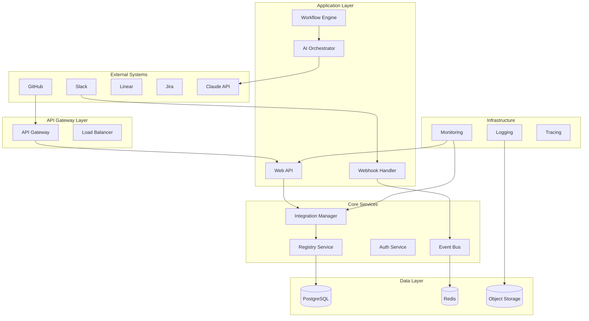

# 🏗️ Системная архитектура Claude Code Bot

## Обзор системы

Claude Code Bot представляет собой автоматизированную платформу для создания интеграций с использованием искусственного интеллекта. Система построена на принципах микросервисной архитектуры с четким разделением ответственности и высокой степенью автономности компонентов.

## Архитектурные принципы

### Основополагающие принципы

1. **AI-First Architecture** — ИИ является центральным компонентом системы
2. **Event-Driven Design** — асинхронная обработка через события
3. **Microservices Architecture** — модульная структура с независимыми сервисами
4. **API-First Approach** — все взаимодействие через четко определенные API
5. **Infrastructure as Code** — вся инфраструктура описана в коде
6. **Security by Design** — безопасность встроена на всех уровнях

### Качественные атрибуты

- **Scalability** — горизонтальное масштабирование компонентов
- **Reliability** — отказоустойчивость и самовосстановление
- **Performance** — низкая латентность и высокая пропускная способность
- **Maintainability** — простота изменений и расширений
- **Observability** — полная видимость состояния системы
- **Security** — защита данных и контроль доступа

## Высокоуровневая архитектура



## Слои архитектуры

### 1. Presentation Layer (Уровень представления)

**Компоненты:**

- **API Gateway** — единая точка входа для всех запросов
- **Load Balancer** — распределение нагрузки
- **Web Interface** — пользовательский интерфейс (планируется)

**Ответственности:**

- Маршрутизация запросов
- Аутентификация и авторизация
- Rate limiting
- Request/Response трансформация
- SSL termination

### 2. Application Layer (Уровень приложения)

**Компоненты:**

- **Web API** — RESTful API для взаимодействия с клиентами
- **Webhook Handler** — обработка входящих webhook'ов
- **AI Orchestrator** — управление взаимодействием с Claude API
- **Workflow Engine** — выполнение автоматизированных процессов

**Ответственности:**

- Бизнес-логика приложения
- Оркестрация сервисов
- Обработка пользовательских запросов
- Управление состоянием workflow'ов

### 3. Core Services Layer (Уровень основных сервисов)

**Компоненты:**

- **Integration Manager** — управление жизненным циклом интеграций
- **Registry Service** — каталог интеграций и метаданные
- **Authentication Service** — управление пользователями и доступом
- **Event Bus** — асинхронная передача сообщений

**Ответственности:**

- Создание и управление интеграциями
- Регистрация и обнаружение сервисов
- Управление идентичностью
- Межсервисная коммуникация

### 4. Data Layer (Уровень данных)

**Компоненты:**

- **PostgreSQL** — основная реляционная база данных
- **Redis** — кеширование и очереди сообщений
- **Object Storage** — хранение артефактов и логов

**Ответственности:**

- Постоянное хранение данных
- Кеширование для производительности
- Хранение больших объектов
- Сессии и временные данные

### 5. Infrastructure Layer (Инфраструктурный уровень)

**Компоненты:**

- **Monitoring** — сбор метрик и алертинг
- **Logging** — централизованное логирование
- **Tracing** — распределенная трассировка
- **Service Mesh** — управление межсервисной коммуникацией

## Ключевые компоненты

### AI Orchestrator

**Назначение:** Управление взаимодействием с Claude API для генерации кода интеграций.

**Функции:**

- Подготовка контекста для Claude API
- Управление сессиями с ИИ
- Обработка ответов и извлечение кода
- Валидация сгенерированного кода
- Retry логика и обработка ошибок

**Интерфейсы:**

```text
interface AIOrchestrator {
    generateIntegration(request: IntegrationRequest): Promise<IntegrationCode>
    validateCode(code: string): Promise<ValidationResult>
    improveIntegration(feedback: Feedback): Promise<IntegrationCode>
}
```

### Integration Manager

**Назначение:** Полное управление жизненным циклом интеграций.

**Функции:**

- Создание новых интеграций
- Версионирование и обновления
- Развертывание и активация
- Мониторинг состояния
- Откат изменений

**Состояния интеграции:**

- `REQUESTED` — запрос создан
- `ANALYZING` — анализ требований
- `GENERATING` — генерация кода
- `TESTING` — автоматическое тестирование
- `REVIEWING` — код ревью
- `DEPLOYING` — развертывание
- `ACTIVE` — активна и работает
- `DEPRECATED` — устарела
- `FAILED` — ошибка создания

### Workflow Engine

**Назначение:** Выполнение автоматизированных процессов создания интеграций.

**Функции:**

- Парсинг и валидация GitHub Issues
- Оркестрация этапов создания интеграции
- Управление состоянием процесса
- Обработка исключений и rollback
- Уведомления о статусе

**Пример workflow:**

```yaml
name: "Create Integration Workflow"
triggers:
  - github.issue.opened
  - github.issue.labeled["integration-request"]

steps:
  - name: "Validate Request"
    service: "validation-service"
    
  - name: "Generate Code"
    service: "ai-orchestrator"
    depends_on: ["Validate Request"]
    
  - name: "Run Tests"
    service: "testing-service"
    depends_on: ["Generate Code"]
    
  - name: "Create PR"
    service: "github-service"
    depends_on: ["Run Tests"]
```

### Event Bus

**Назначение:** Асинхронная коммуникация между компонентами.

**Функции:**

- Публикация и подписка на события
- Гарантированная доставка сообщений
- Порядок обработки событий
- Dead letter queue для ошибок
- Мониторинг потока событий

**Типы событий:**

```typescript
type SystemEvent = 
  | IntegrationRequested
  | IntegrationCreated
  | IntegrationDeployed
  | IntegrationFailed
  | TestsCompleted
  | CodeReviewRequested
  | WebhookReceived
```

## Паттерны проектирования

### 1. Event Sourcing

Все изменения состояния записываются как последовательность событий.

**Преимущества:**

- Полная аудиторская трассировка
- Возможность replay событий
- Временное состояние системы
- Легкое отладка и восстановление

### 2. CQRS (Command Query Responsibility Segregation)

Разделение операций чтения и записи для оптимизации производительности.

**Применение:**

- Команды для изменения состояния интеграций
- Запросы для чтения метаданных
- Оптимизированные представления для UI
- Различные хранилища для команд и запросов

### 3. Saga Pattern

Управление распределенными транзакциями в микросервисной архитектуре.

**Использование:**

- Создание интеграции как последовательность шагов
- Компенсирующие действия при ошибках
- Координация между сервисами
- Гарантия консистентности данных

### 4. Circuit Breaker

Защита от каскадных сбоев при взаимодействии с внешними сервисами.

**Применение:**

- Вызовы Claude API
- Интеграции с внешними системами
- Межсервисные взаимодействия
- Webhook доставка

### 5. Bulkhead Pattern

Изоляция ресурсов для предотвращения влияния сбоев одного компонента на другие.

**Изоляция:**

- Отдельные thread pools для различных операций
- Изолированные database connections
- Отдельные Redis instances для разных задач
- Независимые deployment units

## Масштабирование и производительность

### Горизонтальное масштабирование

**Stateless Services:**

- Web API автоматически масштабируется
- AI Orchestrator поддерживает несколько инстансов
- Workflow Engine может работать в кластере

**Шардинг данных:**

- Партиционирование интеграций по организациям
- Географическое распределение данных
- Кеширование на уровне CDN

### Оптимизация производительности

**Кеширование:**

- Redis для сессий и временных данных
- Application-level кеширование
- Database query caching
- HTTP caching headers

**Асинхронная обработка:**

- Background job processing
- Event-driven архитектура
- Non-blocking I/O операции
- Batch processing для массовых операций

## Безопасность

### Архитектура безопасности

**Принципы:**

- Defense in depth
- Principle of least privilege
- Zero trust network
- Security by design

**Компоненты безопасности:**

- **API Gateway** — аутентификация и авторизация
- **Service Mesh** — mTLS для межсервисной коммуникации
- **Secrets Management** — централизованное управление секретами
- **Audit Logging** — полное логирование действий

### Управление доступом

**Модель авторизации:**

- Role-Based Access Control (RBAC)
- Attribute-Based Access Control (ABAC)
- JWT токены с коротким временем жизни
- Refresh token rotation

**Уровни доступа:**

- **Public** — открытые API для чтения
- **Authenticated** — требует аутентификации
- **Authorized** — требует специальных разрешений
- **Admin** — административные операции

## Мониторинг и наблюдаемость

### Три столпа наблюдаемости

**1. Метрики (Metrics):**

- Business метрики: количество созданных интеграций
- System метрики: CPU, память, сеть
- Application метрики: latency, throughput, errors
- Infrastructure метрики: контейнеры, кластер

**2. Логирование (Logging):**

- Структурированные логи в JSON формате
- Централизованная агрегация логов
- Корреляция через trace ID
- Log sampling для уменьшения объема

**3. Трассировка (Tracing):**

- Распределенная трассировка запросов
- Визуализация dependency графа
- Performance профилирование
- Error tracking и debugging

### Алертинг

**Уровни алертов:**

- **Critical** — немедленное вмешательство требуется
- **Warning** — мониторинг ситуации
- **Info** — информационные уведомления

**Каналы уведомлений:**

- PagerDuty для критических алертов
- Slack для команды разработки
- Email для менее критичных событий
- Dashboard для визуального мониторинга

## Развертывание и инфраструктура

### Container Platform

**Orchestration:** Kubernetes

- Pod автоматическое масштабирование
- Service discovery и load balancing
- Rolling updates без downtime
- Health checks и self-healing

**Container Registry:**

- Приватный registry для образов
- Vulnerability scanning
- Image signing для безопасности
- Multi-stage builds для оптимизации

### CI/CD Pipeline

**Этапы:**

1. **Source** — Git repository
2. **Build** — Docker image creation
3. **Test** — автоматическое тестирование
4. **Security** — vulnerability scanning
5. **Deploy** — staging environment
6. **Validate** — integration tests
7. **Promote** — production deployment

**Инструменты:**

- GitHub Actions для CI/CD
- ArgoCD для GitOps deployment
- Helm для package management
- Terraform для infrastructure

### Environment Strategy

**Окружения:**

- **Development** — локальная разработка
- **Feature** — feature branch deployment
- **Staging** — pre-production testing
- **Production** — production environment
- **Disaster Recovery** — backup environment

## Интеграция с внешними системами

### Claude API Integration

**Паттерны взаимодействия:**

- Request/Response для sync операций
- Streaming для long-running tasks
- Batch processing для массовых операций
- Webhook notifications для async updates

**Управление ресурсами:**

- Rate limiting согласно API limits
- Circuit breaker для resilience
- Retry с exponential backoff
- Request prioritization

### GitHub Integration

**Функциональность:**

- Issue parsing и validation
- Pull request creation
- Code review automation
- Release management
- Webhook handling

**Безопасность:**

- GitHub App authentication
- Webhook signature verification
- Scope-limited permissions
- Audit logging

### External Service Integrations

**Стандартизация:**

- Общий interface для всех интеграций
- Унифицированная обработка ошибок
- Стандартные метрики и логирование
- Единый подход к аутентификации

## Заключение

Архитектура Claude Code Bot спроектирована для обеспечения высокой надежности, масштабируемости и maintainability при автоматическом создании интеграций с помощью ИИ. Использование современных архитектурных паттернов и best practices обеспечивает готовность системы к росту и эволюции.

Ключевые архитектурные решения:

1. **Микросервисная архитектура** обеспечивает независимость компонентов
2. **Event-driven design** позволяет асинхронную обработку
3. **AI-first подход** ставит ИИ в центр системы
4. **Cloud-native принципы** обеспечивают масштабируемость
5. **Security by design** гарантирует защиту данных

Эта архитектура позволяет Claude Code Bot стать платформой следующего поколения для автоматизации интеграций.
