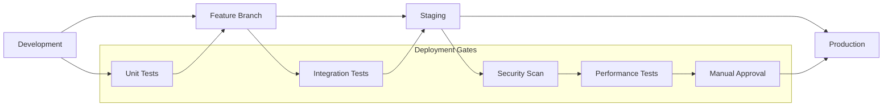

# 🚀 Deployment Guide

## Обзор

Данный документ описывает процессы развертывания Claude Code Bot в различных окружениях. Система использует современные DevOps практики с полной автоматизацией deployment pipeline.

## Архитектура развертывания

### Deployment Strategy

**Принципы:**

- **Infrastructure as Code** — вся инфраструктура описана в коде
- **GitOps** — декларативное управление через Git
- **Blue-Green Deployment** — zero-downtime deployments
- **Progressive Rollout** — постепенное развертывание с мониторингом
- **Automated Rollback** — автоматический откат при проблемах

### Окружения



#### Development Environment

**Цель:** Локальная разработка и тестирование

**Характеристики:**

- Локальные контейнеры через Docker Compose
- Hot reload для быстрой разработки
- Моки внешних сервисов
- Подробное логирование и debugging

**Развертывание:**

```bash
# Локальное развертывание
docker-compose up -d

# С пересборкой
docker-compose up --build -d

# Только определенные сервисы
docker-compose up api worker -d
```

#### Feature Branch Environment

**Цель:** Тестирование feature branches

**Характеристики:**

- Автоматическое создание при открытии PR
- Изолированное окружение для каждой ветки
- Автоматическое удаление после merge
- Preview URLs для тестирования

**Автоматизация:**

```yaml
# .github/workflows/feature-deploy.yml
name: Feature Branch Deployment
on:
  pull_request:
    types: [opened, synchronize]

jobs:
  deploy-feature:
    runs-on: ubuntu-latest
    steps:
      - name: Deploy Feature Branch
        run: |
          export FEATURE_NAME=${GITHUB_HEAD_REF}
          ./scripts/deploy-feature.sh $FEATURE_NAME
```

#### Staging Environment

**Цель:** Pre-production тестирование

**Характеристики:**

- Максимально близко к production
- Реальные внешние интеграции (sandbox режим)
- Полный набор тестов
- Performance и load testing

**Deployment Process:**

1. Код merge в main branch
2. Автоматический build и тестирование
3. Deployment в staging
4. Automated testing suite
5. Performance benchmarks
6. Security scanning

#### Production Environment

**Цель:** Production workloads

**Характеристики:**

- High availability setup
- Auto-scaling capabilities
- Comprehensive monitoring
- Disaster recovery готовность

**Deployment Gates:**

- Все тесты прошли в staging
- Security scan completed
- Performance benchmarks met
- Manual approval obtained
- Change advisory board approval (if required)

## Infrastructure as Code

### Terraform Configuration

**Структура:**

```text
infrastructure/
├── modules/                    # Переиспользуемые модули
│   ├── kubernetes/            # Kubernetes cluster
│   ├── database/              # PostgreSQL и Redis
│   ├── storage/               # Object storage
│   └── monitoring/            # Observability stack
├── environments/              # Environment-specific configs
│   ├── development/
│   ├── staging/
│   └── production/
└── shared/                    # Shared resources
    ├── networking/
    └── security/
```

**Core Infrastructure:**

```hcl
# infrastructure/modules/kubernetes/main.tf
resource "kubernetes_cluster" "main" {
  name     = var.cluster_name
  location = var.region
  
  node_config {
    machine_type = var.node_machine_type
    disk_size_gb = var.node_disk_size
    
    oauth_scopes = [
      "https://www.googleapis.com/auth/cloud-platform"
    ]
  }
  
  addons_config {
    http_load_balancing {
      disabled = false
    }
    
    horizontal_pod_autoscaling {
      disabled = false
    }
  }
}

# Database setup
resource "google_sql_database_instance" "postgres" {
  name             = "${var.environment}-postgres"
  database_version = "POSTGRES_15"
  region          = var.region
  
  settings {
    tier = var.db_tier
    
    backup_configuration {
      enabled                        = true
      start_time                     = "03:00"
      point_in_time_recovery_enabled = true
    }
    
    ip_configuration {
      ipv4_enabled    = false
      private_network = var.vpc_network
    }
  }
}
```

### Kubernetes Manifests

**Application Deployment:**

```yaml
# k8s/api/deployment.yaml
apiVersion: apps/v1
kind: Deployment
metadata:
  name: claude-code-bot-api
  namespace: claude-code-bot
spec:
  replicas: 3
  selector:
    matchLabels:
      app: api
  template:
    metadata:
      labels:
        app: api
    spec:
      containers:
      - name: api
        image: ghcr.io/claude-code-bot/api:latest
        ports:
        - containerPort: 8000
        env:
        - name: DATABASE_URL
          valueFrom:
            secretKeyRef:
              name: db-credentials
              key: url
        resources:
          requests:
            memory: "256Mi"
            cpu: "250m"
          limits:
            memory: "512Mi"
            cpu: "500m"
        livenessProbe:
          httpGet:
            path: /health
            port: 8000
          initialDelaySeconds: 30
          periodSeconds: 10
        readinessProbe:
          httpGet:
            path: /ready
            port: 8000
          initialDelaySeconds: 5
          periodSeconds: 5
```

**Service Configuration:**

```yaml
# k8s/api/service.yaml
apiVersion: v1
kind: Service
metadata:
  name: api-service
  namespace: claude-code-bot
spec:
  selector:
    app: api
  ports:
  - protocol: TCP
    port: 80
    targetPort: 8000
  type: ClusterIP

---
apiVersion: networking.k8s.io/v1
kind: Ingress
metadata:
  name: api-ingress
  annotations:
    kubernetes.io/ingress.class: nginx
    cert-manager.io/cluster-issuer: letsencrypt-prod
spec:
  tls:
  - hosts:
    - api.claude-code-bot.com
    secretName: api-tls
  rules:
  - host: api.claude-code-bot.com
    http:
      paths:
      - path: /
        pathType: Prefix
        backend:
          service:
            name: api-service
            port:
              number: 80
```

## CI/CD Pipeline

### GitHub Actions Workflows

**Main Deployment Pipeline:**

```yaml
# .github/workflows/deploy.yml
name: Deploy to Production

on:
  push:
    branches: [main]
  workflow_dispatch:
    inputs:
      environment:
        description: 'Target environment'
        required: true
        default: 'staging'
        type: choice
        options:
        - staging
        - production

jobs:
  build:
    runs-on: ubuntu-latest
    outputs:
      image-tag: ${{ steps.meta.outputs.tags }}
      image-digest: ${{ steps.build.outputs.digest }}
    steps:
      - name: Checkout
        uses: actions/checkout@v4
        
      - name: Set up Docker Buildx
        uses: docker/setup-buildx-action@v3
        
      - name: Login to Container Registry
        uses: docker/login-action@v3
        with:
          registry: ghcr.io
          username: ${{ github.actor }}
          password: ${{ secrets.GITHUB_TOKEN }}
          
      - name: Extract metadata
        id: meta
        uses: docker/metadata-action@v5
        with:
          images: ghcr.io/${{ github.repository }}
          tags: |
            type=ref,event=branch
            type=ref,event=pr
            type=sha
            
      - name: Build and push
        id: build
        uses: docker/build-push-action@v5
        with:
          context: .
          push: true
          tags: ${{ steps.meta.outputs.tags }}
          labels: ${{ steps.meta.outputs.labels }}
          cache-from: type=gha
          cache-to: type=gha,mode=max

  security-scan:
    needs: build
    runs-on: ubuntu-latest
    steps:
      - name: Run Trivy vulnerability scanner
        uses: aquasecurity/trivy-action@master
        with:
          image-ref: ${{ needs.build.outputs.image-tag }}
          format: 'sarif'
          output: 'trivy-results.sarif'
          
      - name: Upload Trivy scan results
        uses: github/codeql-action/upload-sarif@v3
        with:
          sarif_file: 'trivy-results.sarif'

  deploy-staging:
    needs: [build, security-scan]
    runs-on: ubuntu-latest
    environment: staging
    steps:
      - name: Checkout
        uses: actions/checkout@v4
        
      - name: Deploy to Staging
        run: |
          echo "Deploying ${{ needs.build.outputs.image-tag }} to staging"
          ./scripts/deploy.sh staging ${{ needs.build.outputs.image-tag }}
          
      - name: Run Integration Tests
        run: |
          ./scripts/integration-tests.sh staging

  deploy-production:
    needs: [build, security-scan, deploy-staging]
    runs-on: ubuntu-latest
    environment: production
    if: github.ref == 'refs/heads/main'
    steps:
      - name: Checkout
        uses: actions/checkout@v4
        
      - name: Deploy to Production
        run: |
          echo "Deploying ${{ needs.build.outputs.image-tag }} to production"
          ./scripts/deploy.sh production ${{ needs.build.outputs.image-tag }}
          
      - name: Health Check
        run: |
          ./scripts/health-check.sh production
```

### Deployment Scripts

**Core Deployment Script:**

```bash
#!/bin/bash
# scripts/deploy.sh

set -euo pipefail

ENVIRONMENT=$1
IMAGE_TAG=$2

echo "Deploying to $ENVIRONMENT with image $IMAGE_TAG"

# Validate inputs
if [[ -z "$ENVIRONMENT" || -z "$IMAGE_TAG" ]]; then
    echo "Usage: $0 <environment> <image-tag>"
    exit 1
fi

# Set environment-specific variables
case $ENVIRONMENT in
    "staging")
        NAMESPACE="claude-code-bot-staging"
        CLUSTER_NAME="staging-cluster"
        ;;
    "production")
        NAMESPACE="claude-code-bot-prod"
        CLUSTER_NAME="production-cluster"
        ;;
    *)
        echo "Unknown environment: $ENVIRONMENT"
        exit 1
        ;;
esac

# Authenticate with cluster
gcloud container clusters get-credentials $CLUSTER_NAME --region=us-central1

# Apply configuration
envsubst < k8s/api/deployment.yaml | kubectl apply -f -
envsubst < k8s/worker/deployment.yaml | kubectl apply -f -

# Wait for rollout
kubectl rollout status deployment/claude-code-bot-api -n $NAMESPACE
kubectl rollout status deployment/claude-code-bot-worker -n $NAMESPACE

# Verify deployment
kubectl get pods -n $NAMESPACE

echo "Deployment to $ENVIRONMENT completed successfully"
```

## Blue-Green Deployment

### Процесс

**1. Preparation Phase**

```bash
# Создание green environment
kubectl create namespace claude-code-bot-green

# Deploy новой версии в green
./scripts/deploy.sh green $NEW_IMAGE_TAG

# Warm up services
./scripts/warmup.sh green
```

**2. Testing Phase**

```bash
# Smoke tests
./scripts/smoke-tests.sh green

# Load tests
./scripts/load-tests.sh green

# Integration tests
./scripts/integration-tests.sh green
```

**3. Traffic Switch**

```bash
# Gradual traffic switch
./scripts/switch-traffic.sh blue green 10  # 10% to green
sleep 300
./scripts/switch-traffic.sh blue green 50  # 50% to green
sleep 300
./scripts/switch-traffic.sh blue green 100 # 100% to green

# Monitor metrics
./scripts/monitor-deployment.sh green
```

**4. Cleanup**

```bash
# If successful
kubectl delete namespace claude-code-bot-blue
kubectl label namespace claude-code-bot-green env=production

# If rollback needed
./scripts/switch-traffic.sh green blue 100
kubectl delete namespace claude-code-bot-green
```

### Traffic Management

**Ingress Configuration для Blue-Green:**

```yaml
apiVersion: networking.k8s.io/v1
kind: Ingress
metadata:
  name: api-ingress
  annotations:
    nginx.ingress.kubernetes.io/canary: "true"
    nginx.ingress.kubernetes.io/canary-weight: "0"
spec:
  rules:
  - host: api.claude-code-bot.com
    http:
      paths:
      - path: /
        pathType: Prefix
        backend:
          service:
            name: api-service-green
            port:
              number: 80
```

## Database Migrations

### Migration Strategy

**Принципы:**

- Backward compatible migrations
- Zero-downtime migrations
- Rollback capability
- Data integrity preservation

**Process:**

```bash
# scripts/migrate.sh
#!/bin/bash

set -euo pipefail

ENVIRONMENT=$1
DIRECTION=${2:-up}

echo "Running database migration for $ENVIRONMENT"

# Get database credentials
DB_URL=$(kubectl get secret db-credentials -o jsonpath='{.data.url}' | base64 -d)

# Run migrations
case $DIRECTION in
    "up")
        alembic upgrade head
        ;;
    "down")
        alembic downgrade -1
        ;;
    *)
        echo "Unknown direction: $DIRECTION"
        exit 1
        ;;
esac

echo "Migration completed successfully"
```

**Alembic Configuration:**

```python
# alembic/env.py
from alembic import context
from sqlalchemy import engine_from_config, pool
from logging.config import fileConfig
import os

# Import models for autogenerate support
from app.models import Base

config = context.config

# Set database URL from environment
config.set_main_option(
    "sqlalchemy.url", 
    os.getenv("DATABASE_URL", "postgresql://localhost/claude_code_bot")
)

if config.config_file_name is not None:
    fileConfig(config.config_file_name)

target_metadata = Base.metadata

def run_migrations_online():
    """Run migrations in 'online' mode."""
    connectable = engine_from_config(
        config.get_section(config.config_ini_section),
        prefix="sqlalchemy.",
        poolclass=pool.NullPool,
    )

    with connectable.connect() as connection:
        context.configure(
            connection=connection,
            target_metadata=target_metadata,
            compare_type=True,
            compare_server_default=True
        )

        with context.begin_transaction():
            context.run_migrations()

run_migrations_online()
```

### Zero-Downtime Migration Patterns

**1. Additive Changes**

- Добавление новых столбцов с DEFAULT values
- Создание новых индексов CONCURRENTLY
- Добавление новых таблиц

**2. Schema Evolution**

```sql
-- Step 1: Add new column
ALTER TABLE integrations ADD COLUMN new_field VARCHAR(255) DEFAULT 'default_value';

-- Step 2: Deploy application code that writes to both fields

-- Step 3: Backfill data
UPDATE integrations SET new_field = old_field WHERE new_field = 'default_value';

-- Step 4: Deploy application code that reads from new field

-- Step 5: Remove old column
ALTER TABLE integrations DROP COLUMN old_field;
```

## Monitoring и Health Checks

### Application Health Checks

**Health Endpoints:**

```python
# app/health.py
from fastapi import APIRouter, HTTPException
from sqlalchemy import text
from .database import get_db
from .cache import redis_client

router = APIRouter()

@router.get("/health")
async def health_check():
    """Liveness probe endpoint"""
    return {"status": "healthy", "timestamp": datetime.utcnow()}

@router.get("/ready")
async def readiness_check():
    """Readiness probe endpoint"""
    checks = {
        "database": await check_database(),
        "redis": await check_redis(),
        "claude_api": await check_claude_api()
    }
    
    if not all(checks.values()):
        raise HTTPException(status_code=503, detail=checks)
    
    return {"status": "ready", "checks": checks}

async def check_database():
    try:
        db = get_db()
        result = await db.execute(text("SELECT 1"))
        return result.scalar() == 1
    except Exception:
        return False

async def check_redis():
    try:
        await redis_client.ping()
        return True
    except Exception:
        return False

async def check_claude_api():
    try:
        # Simple API call to Claude
        response = await claude_client.health_check()
        return response.status_code == 200
    except Exception:
        return False
```

### Kubernetes Health Configuration

```yaml
# Deployment health checks
livenessProbe:
  httpGet:
    path: /health
    port: 8000
  initialDelaySeconds: 30
  periodSeconds: 10
  timeoutSeconds: 5
  failureThreshold: 3

readinessProbe:
  httpGet:
    path: /ready
    port: 8000
  initialDelaySeconds: 5
  periodSeconds: 5
  timeoutSeconds: 3
  failureThreshold: 3
```

### Deployment Metrics

**Key Metrics:**

- Deployment frequency
- Lead time for changes
- Mean time to recovery (MTTR)
- Change failure rate

**Monitoring Setup:**

```yaml
# monitoring/deployment-metrics.yaml
apiVersion: monitoring.coreos.com/v1
kind: ServiceMonitor
metadata:
  name: deployment-metrics
spec:
  selector:
    matchLabels:
      app: claude-code-bot
  endpoints:
  - port: metrics
    interval: 30s
    path: /metrics
```

## Disaster Recovery

### Backup Strategy

**Database Backups:**

- Automated daily backups
- Point-in-time recovery capability
- Cross-region backup replication
- Backup integrity verification

**Configuration Backups:**

- Git-based configuration management
- Encrypted secrets backup
- Infrastructure state backup
- Application state snapshots

### Recovery Procedures

**RTO/RPO Targets:**

- Recovery Time Objective (RTO): 1 hour
- Recovery Point Objective (RPO): 15 minutes

**Recovery Scenarios:**

**1. Service Degradation**

```bash
# Quick rollback
kubectl rollout undo deployment/claude-code-bot-api
kubectl rollout status deployment/claude-code-bot-api
```

**2. Database Failure**

```bash
# Restore from backup
gcloud sql backups restore $BACKUP_ID --restore-instance=production-db
./scripts/migrate.sh production up
```

**3. Complete Region Failure**

```bash
# Failover to DR region
./scripts/failover-region.sh us-west1
./scripts/verify-services.sh us-west1
```

### Incident Response

**Incident Severity Levels:**

- **P0** - Complete service outage
- **P1** - Significant service degradation
- **P2** - Minor service impact
- **P3** - No service impact

**Response Procedures:**

1. Incident detection и alerting
2. Initial assessment и classification
3. Response team mobilization
4. Investigation и mitigation
5. Recovery и verification
6. Post-mortem и improvements

## Security

### Deployment Security

**Container Security:**

- Base images vulnerability scanning
- Minimal attack surface (distroless images)
- Non-root container execution
- Read-only filesystems
- Security contexts enforcement

**Network Security:**

- Network policies для pod isolation
- mTLS для inter-service communication
- API Gateway с authentication
- WAF для external traffic protection

**Secrets Management:**

```yaml
# Using Kubernetes secrets
apiVersion: v1
kind: Secret
metadata:
  name: app-secrets
type: Opaque
data:
  database-url: <base64-encoded-value>
  claude-api-key: <base64-encoded-value>
  jwt-secret: <base64-encoded-value>

---
# Mount secrets in deployment
spec:
  template:
    spec:
      containers:
      - name: api
        env:
        - name: DATABASE_URL
          valueFrom:
            secretKeyRef:
              name: app-secrets
              key: database-url
```

### Compliance

**Security Standards:**

- OWASP Top 10 compliance
- CIS Kubernetes Benchmark
- PCI DSS requirements (если applicable)
- SOC 2 Type II compliance

**Audit Requirements:**

- Complete deployment audit trail
- Access logging и monitoring
- Change management records
- Compliance reporting

## Troubleshooting

### Common Deployment Issues

**1. ImagePullBackOff**

```bash
# Diagnose
kubectl describe pod <pod-name>
kubectl get events --sort-by=.metadata.creationTimestamp

# Solutions
- Check image registry credentials
- Verify image tag exists
- Check network connectivity
```

**2. CrashLoopBackOff**

```bash
# Diagnose
kubectl logs <pod-name> --previous
kubectl describe pod <pod-name>

# Common causes
- Application startup failures
- Missing environment variables
- Database connectivity issues
- Resource constraints
```

**3. Service Unreachable**

```bash
# Diagnose
kubectl get svc
kubectl describe svc <service-name>
kubectl get endpoints <service-name>

# Solutions
- Check service selector labels
- Verify pod readiness
- Check network policies
```

### Rollback Procedures

**Immediate Rollback:**

```bash
# Rollback to previous version
kubectl rollout undo deployment/claude-code-bot-api

# Rollback to specific revision
kubectl rollout undo deployment/claude-code-bot-api --to-revision=2

# Check rollout status
kubectl rollout status deployment/claude-code-bot-api
```

**Database Rollback:**

```bash
# Database migration rollback
./scripts/migrate.sh production down

# Full database restore (if needed)
gcloud sql backups restore $BACKUP_ID --restore-instance=production-db
```

## Performance Optimization

### Deployment Performance

**Build Optimization:**

- Multi-stage Docker builds
- Build cache utilization
- Parallel build processes
- Image layer optimization

**Deployment Speed:**

- Rolling update strategy optimization
- Readiness probe tuning
- Resource allocation optimization
- Pre-pulling container images

### Resource Management

**Resource Quotas:**

```yaml
apiVersion: v1
kind: ResourceQuota
metadata:
  name: claude-code-bot-quota
spec:
  hard:
    requests.cpu: "4"
    requests.memory: 8Gi
    limits.cpu: "8"
    limits.memory: 16Gi
    persistentvolumeclaims: "10"
```

**Horizontal Pod Autoscaling:**

```yaml
apiVersion: autoscaling/v2
kind: HorizontalPodAutoscaler
metadata:
  name: api-hpa
spec:
  scaleTargetRef:
    apiVersion: apps/v1
    kind: Deployment
    name: claude-code-bot-api
  minReplicas: 3
  maxReplicas: 10
  metrics:
  - type: Resource
    resource:
      name: cpu
      target:
        type: Utilization
        averageUtilization: 70
  - type: Resource
    resource:
      name: memory
      target:
        type: Utilization
        averageUtilization: 80
```

## Заключение

Deployment процесс Claude Code Bot построен на современных DevOps принципах с полной автоматизацией и focus на reliability, security, и performance.

Ключевые достижения:

- **Zero-downtime deployments** через blue-green strategy
- **Automated rollback** при проблемах
- **Comprehensive monitoring** на всех уровнях
- **Security-first approach** во всех процессах
- **Infrastructure as Code** для reproducibility
- **GitOps workflows** для audit trail

Система готова к production использованию и может масштабироваться по мере роста нагрузки и требований.
