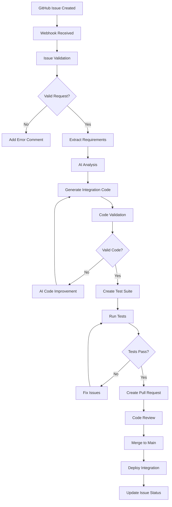
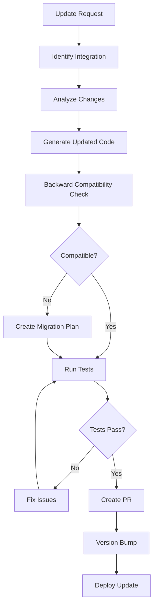
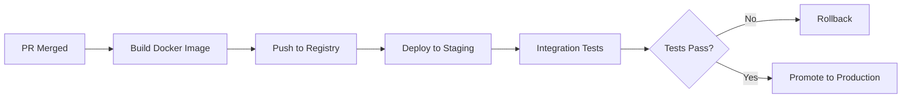
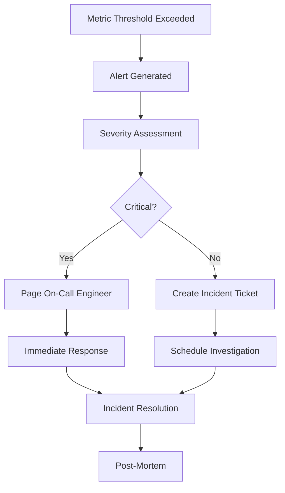
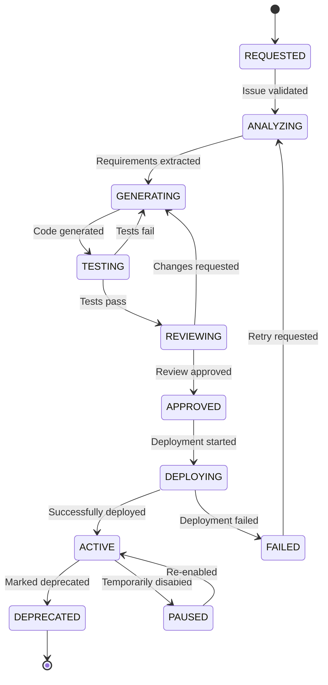

# 🔄 Процессы и Workflow

## Обзор

Документ описывает все автоматизированные процессы и workflow'ы в системе Claude Code Bot. Система построена на принципах event-driven архитектуры с полной автоматизацией процесса создания интеграций.

## Основные процессы

### 1. Процесс создания интеграции

#### Триггер
- Создание GitHub Issue с лейблом `integration-request`
- Использование специального шаблона issue

#### Этапы workflow



#### Детальное описание этапов

**1. Issue Validation**
- Проверка формата issue согласно шаблону
- Валидация обязательных полей
- Проверка типа интеграции
- Валидация target service

**2. Requirements Extraction**
- Парсинг описания интеграции
- Извлечение технических требований
- Определение API endpoints
- Сбор примеров использования

**3. AI Analysis**
- Анализ требований через Claude API
- Формирование технического задания
- Создание архитектуры интеграции
- Планирование implementation

**4. Code Generation**
- Генерация основного кода интеграции
- Создание конфигурационных файлов
- Генерация документации
- Создание примеров использования

**5. Validation & Testing**
- Статический анализ кода
- Проверка соответствия стандартам
- Генерация и выполнение тестов
- Валидация безопасности

**6. Pull Request Creation**
- Создание feature branch
- Коммит изменений
- Создание PR с описанием
- Назначение reviewers

### 2. Процесс обновления интеграции

#### Триггер
- GitHub Issue с лейблом `integration-update`
- Pull Request для существующей интеграции

#### Workflow обновления



### 3. Процесс code review

#### Автоматический code review

**AI Review Process:**
1. Статический анализ кода (ESLint, Pylint, etc.)
2. Security scanning (Bandit, Snyk)
3. Performance analysis
4. Best practices validation
5. Documentation completeness check

**Automated Checks:**
- Code coverage > 80%
- All tests passing
- No security vulnerabilities
- Proper error handling
- API documentation updated

#### Human Review Process

**Review Criteria:**
- Business logic correctness
- Architecture alignment
- User experience impact
- Integration patterns consistency
- Documentation quality

**Review Workflow:**
1. Automated checks must pass
2. AI review summary provided
3. Human reviewer assigned
4. Review comments addressed
5. Final approval and merge

### 4. Deployment процесс

#### Staging Deployment



#### Production Deployment

**Blue-Green Deployment Strategy:**
1. Deploy to green environment
2. Run smoke tests
3. Switch traffic gradually
4. Monitor health metrics
5. Complete switchover or rollback

**Deployment Gates:**
- All tests passing in staging
- Security scan passed
- Performance benchmarks met
- Documentation updated
- Change approval obtained

### 5. Мониторинг и алертинг

#### Health Check Process

**Continuous Monitoring:**
- Service health endpoints
- Integration connectivity
- Performance metrics
- Error rates
- User satisfaction scores

**Alerting Workflow:**


## GitHub Actions Workflows

### 1. Integration Request Workflow

**File:** `.github/workflows/integration-request.yml`

**Triggers:**
- `issues.opened` с лейблом `integration-request`
- `issues.edited` для integration requests

**Jobs:**
1. **validate-request**
   - Проверка формата issue
   - Валидация обязательных полей
   - Проверка прав пользователя

2. **analyze-requirements**
   - Извлечение требований
   - Анализ через Claude API
   - Создание технического задания

3. **generate-integration**
   - Генерация кода интеграции
   - Создание тестов
   - Генерация документации

4. **create-pull-request**
   - Создание feature branch
   - Коммит изменений
   - Создание PR

### 2. Code Review Workflow

**File:** `.github/workflows/code-review.yml`

**Triggers:**
- `pull_request.opened`
- `pull_request.synchronize`

**Jobs:**
1. **automated-review**
   - Статический анализ
   - Security scanning
   - Performance testing
   - Documentation check

2. **ai-review**
   - Claude API анализ кода
   - Генерация review комментариев
   - Предложения улучшений

3. **human-review-assignment**
   - Определение нужности human review
   - Назначение reviewers
   - Создание review request

### 3. Deployment Workflow

**File:** `.github/workflows/deploy.yml`

**Triggers:**
- `push` to main branch
- Manual trigger для emergency deploys

**Jobs:**
1. **build-and-test**
   - Docker image build
   - Unit и integration tests
   - Security scanning

2. **deploy-staging**
   - Deploy к staging environment
   - Smoke tests
   - Integration validation

3. **deploy-production**
   - Blue-green deployment
   - Traffic switching
   - Health monitoring

### 4. Integration Testing Workflow

**File:** `.github/workflows/integration-tests.yml`

**Triggers:**
- Scheduled (nightly)
- После deployment
- Manual trigger

**Jobs:**
1. **test-all-integrations**
   - Тестирование всех активных интеграций
   - End-to-end тесты
   - Performance benchmarks

2. **compatibility-tests**
   - Backward compatibility
   - API version compatibility
   - Breaking changes detection

## Управление состоянием

### State Management

**Integration States:**
- `REQUESTED` - запрос создан
- `ANALYZING` - анализ требований
- `GENERATING` - генерация кода
- `TESTING` - выполнение тестов
- `REVIEWING` - code review
- `APPROVED` - одобрено для deployment
- `DEPLOYING` - процесс развертывания
- `ACTIVE` - активна и работает
- `DEPRECATED` - устарела, планируется удаление
- `FAILED` - ошибка в процессе создания
- `PAUSED` - временно приостановлена

### State Transitions



### Event Handling

**Event Types:**
```typescript
interface IntegrationEvent {
  id: string
  timestamp: Date
  type: EventType
  integrationId: string
  payload: EventPayload
  metadata: EventMetadata
}

enum EventType {
  INTEGRATION_REQUESTED = 'integration.requested',
  REQUIREMENTS_ANALYZED = 'requirements.analyzed',
  CODE_GENERATED = 'code.generated',
  TESTS_COMPLETED = 'tests.completed',
  REVIEW_COMPLETED = 'review.completed',
  DEPLOYMENT_STARTED = 'deployment.started',
  DEPLOYMENT_COMPLETED = 'deployment.completed',
  INTEGRATION_ACTIVATED = 'integration.activated',
  ERROR_OCCURRED = 'error.occurred'
}
```

## Обработка ошибок

### Error Recovery Strategies

**1. Retry Logic**
- Exponential backoff для API calls
- Maximum retry attempts
- Circuit breaker pattern
- Dead letter queue для failed events

**2. Rollback Procedures**
- Automatic rollback при deployment failures
- State rollback для failed integrations
- Database transaction rollback
- Configuration rollback

**3. Manual Intervention**
- Admin dashboard для manual control
- Emergency stop procedures
- Manual state transitions
- Override mechanisms

### Error Categories

**1. Recoverable Errors**
- Network timeouts
- Rate limiting
- Temporary service unavailability
- Resource exhaustion

**Handling:** Automatic retry с backoff

**2. Non-Recoverable Errors**
- Invalid input data
- Authentication failures
- Permission denied
- Malformed requests

**Handling:** Immediate failure с notification

**3. Critical Errors**
- Data corruption
- Security breaches
- System failures
- Integration outages

**Handling:** Immediate escalation, incident creation

## Performance Optimization

### Workflow Optimization

**1. Parallel Processing**
- Concurrent code generation
- Parallel test execution
- Async webhook processing
- Batch operations

**2. Caching Strategies**
- Claude API response caching
- Code template caching
- Test result caching
- Metadata caching

**3. Resource Management**
- Queue management для background jobs
- Resource pooling для API connections
- Load balancing для workflow engines
- Auto-scaling для processing capacity

### Metrics and Monitoring

**Workflow Metrics:**
- Integration creation time
- Success/failure rates
- Code review duration
- Deployment frequency
- Time to production

**Performance Metrics:**
- API response times
- Queue processing times
- Resource utilization
- Error rates
- User satisfaction scores

## Security Considerations

### Secure Workflows

**1. Input Validation**
- GitHub issue sanitization
- Code injection prevention
- Parameter validation
- Schema validation

**2. Access Control**
- GitHub App permissions
- Service account management
- API key rotation
- RBAC enforcement

**3. Audit Logging**
- Complete workflow tracing
- User action logging
- System event logging
- Security event monitoring

### Compliance

**Requirements:**
- SOC 2 compliance
- GDPR compliance
- Security best practices
- Industry standards adherence

**Implementation:**
- Data encryption in transit и at rest
- Access logging и monitoring
- Regular security audits
- Incident response procedures

## Workflow Configuration

### Environment-Specific Settings

**Development:**
- Fast feedback loops
- Detailed logging
- Debug information
- Test data usage

**Staging:**
- Production-like environment
- Integration testing
- Performance testing
- Security scanning

**Production:**
- High availability
- Performance optimization
- Minimal logging
- Real data usage

### Feature Flags

**Workflow Features:**
- AI-powered code review
- Automatic deployment
- Integration testing
- Performance monitoring

**Configuration:**
```yaml
features:
  ai_code_review: true
  auto_deployment: false
  integration_testing: true
  performance_monitoring: true
  
environments:
  development:
    ai_code_review: true
    auto_deployment: true
  staging:
    ai_code_review: true
    auto_deployment: true
  production:
    ai_code_review: true
    auto_deployment: false
```

## Troubleshooting

### Common Issues

**1. Integration Creation Fails**
- Проверить Claude API availability
- Валидировать issue format
- Проверить GitHub permissions
- Анализировать error logs

**2. Tests Failing**
- Проверить test environment
- Валидировать test data
- Проверить external dependencies
- Анализировать test results

**3. Deployment Issues**
- Проверить infrastructure health
- Валидировать configuration
- Проверить resource availability
- Анализировать deployment logs

### Debugging Workflows

**Tools:**
- GitHub Actions logs
- Application logs
- Metrics dashboards
- Tracing systems

**Procedures:**
1. Identify failing workflow
2. Analyze logs и metrics
3. Check external dependencies
4. Validate configuration
5. Test fix in staging
6. Deploy fix to production

## Заключение

Workflow система Claude Code Bot обеспечивает полностью автоматизированный процесс создания интеграций от GitHub issue до production deployment. Использование современных practices и инструментов гарантирует высокое качество, безопасность и надежность всех процессов.

Ключевые особенности:
- Полная автоматизация с AI-первым подходом
- Comprehensive testing на всех этапах
- Security-first approach
- Observable и debuggable процессы
- Scalable и maintainable архитектура

Система готова к масштабированию и может обрабатывать большое количество запросов на создание интеграций при сохранении высокого качества и производительности.
