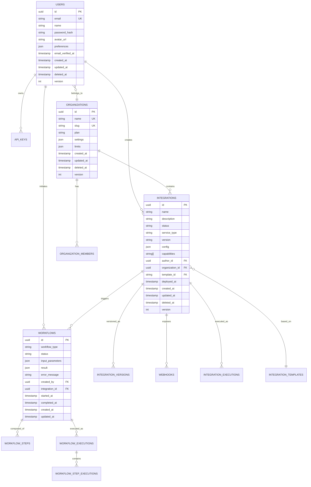

# 🗄️ Схема базы данных — Claude Code Bot

## Обзор схемы

Claude Code Bot использует PostgreSQL как основную базу данных для хранения всех критически важных данных системы. Схема спроектирована с учетом принципов нормализации, производительности и масштабируемости.

## Принципы проектирования схемы

### Архитектурные принципы

1. **Нормализация до 3NF** — устранение избыточности данных
2. **Soft Delete** — логическое удаление для audit trail
3. **Temporal Data** — отслеживание изменений во времени
4. **Event Sourcing** — хранение всех изменений как событий
5. **ACID Compliance** — гарантии транзакционности

### Конвенции именования

- **Таблицы**: snake_case, множественное число (`users`, `integrations`)
- **Столбцы**: snake_case (`created_at`, `user_id`)
- **Индексы**: `idx_{table}_{columns}` (`idx_integrations_status`)
- **Foreign Keys**: `fk_{table}_{referenced_table}` (`fk_integrations_users`)
- **Primary Keys**: `pk_{table}` (`pk_users`)

### Стандартные поля

Все основные таблицы содержат стандартные поля:

```sql
id UUID PRIMARY KEY DEFAULT gen_random_uuid(),
created_at TIMESTAMP WITH TIME ZONE DEFAULT CURRENT_TIMESTAMP,
updated_at TIMESTAMP WITH TIME ZONE DEFAULT CURRENT_TIMESTAMP,
deleted_at TIMESTAMP WITH TIME ZONE NULL,
version INTEGER DEFAULT 1
```

## Диаграмма ER



## Детальная схема таблиц

### Пользователи и организации

#### users

Основная таблица пользователей системы.

```sql
CREATE TABLE users (
    id UUID PRIMARY KEY DEFAULT gen_random_uuid(),
    email VARCHAR(255) NOT NULL UNIQUE,
    name VARCHAR(255) NOT NULL,
    password_hash VARCHAR(255) NOT NULL,
    avatar_url VARCHAR(500),
    preferences JSONB DEFAULT '{}',
    email_verified_at TIMESTAMP WITH TIME ZONE,
    last_login_at TIMESTAMP WITH TIME ZONE,
    is_active BOOLEAN DEFAULT true,
    created_at TIMESTAMP WITH TIME ZONE DEFAULT CURRENT_TIMESTAMP,
    updated_at TIMESTAMP WITH TIME ZONE DEFAULT CURRENT_TIMESTAMP,
    deleted_at TIMESTAMP WITH TIME ZONE,
    version INTEGER DEFAULT 1
);

-- Индексы
CREATE INDEX idx_users_email ON users(email) WHERE deleted_at IS NULL;
CREATE INDEX idx_users_active ON users(is_active) WHERE deleted_at IS NULL;
CREATE INDEX idx_users_created_at ON users(created_at);

-- Триггер для updated_at
CREATE TRIGGER trigger_users_updated_at 
    BEFORE UPDATE ON users 
    FOR EACH ROW 
    EXECUTE FUNCTION update_timestamp();
```

**Поля:**

- `id` — уникальный идентификатор пользователя
- `email` — email адрес (unique, используется для входа)
- `name` — полное имя пользователя
- `password_hash` — bcrypt хеш пароля
- `avatar_url` — URL аватара пользователя
- `preferences` — пользовательские настройки (JSON)
- `email_verified_at` — время подтверждения email
- `last_login_at` — время последнего входа
- `is_active` — статус активности аккаунта

#### organizations

Организации для группировки пользователей и интеграций.

```sql
CREATE TABLE organizations (
    id UUID PRIMARY KEY DEFAULT gen_random_uuid(),
    name VARCHAR(255) NOT NULL,
    slug VARCHAR(100) NOT NULL UNIQUE,
    description TEXT,
    plan VARCHAR(50) DEFAULT 'free',
    settings JSONB DEFAULT '{}',
    limits JSONB DEFAULT '{}',
    usage_stats JSONB DEFAULT '{}',
    created_at TIMESTAMP WITH TIME ZONE DEFAULT CURRENT_TIMESTAMP,
    updated_at TIMESTAMP WITH TIME ZONE DEFAULT CURRENT_TIMESTAMP,
    deleted_at TIMESTAMP WITH TIME ZONE,
    version INTEGER DEFAULT 1
);

CREATE INDEX idx_organizations_slug ON organizations(slug) WHERE deleted_at IS NULL;
CREATE INDEX idx_organizations_plan ON organizations(plan);
```

**Поля:**

- `slug` — URL-friendly идентификатор организации
- `plan` — тарифный план (free, pro, enterprise)
- `settings` — настройки организации
- `limits` — лимиты использования
- `usage_stats` — статистика использования

#### organization_members

Связь пользователей с организациями.

```sql
CREATE TABLE organization_members (
    id UUID PRIMARY KEY DEFAULT gen_random_uuid(),
    organization_id UUID NOT NULL REFERENCES organizations(id),
    user_id UUID NOT NULL REFERENCES users(id),
    role VARCHAR(50) DEFAULT 'member',
    permissions JSONB DEFAULT '[]',
    invited_by UUID REFERENCES users(id),
    joined_at TIMESTAMP WITH TIME ZONE DEFAULT CURRENT_TIMESTAMP,
    created_at TIMESTAMP WITH TIME ZONE DEFAULT CURRENT_TIMESTAMP,
    updated_at TIMESTAMP WITH TIME ZONE DEFAULT CURRENT_TIMESTAMP,
    
    UNIQUE(organization_id, user_id)
);

CREATE INDEX idx_org_members_org_id ON organization_members(organization_id);
CREATE INDEX idx_org_members_user_id ON organization_members(user_id);
CREATE INDEX idx_org_members_role ON organization_members(role);
```

**Роли:**

- `owner` — владелец организации
- `admin` — администратор
- `developer` — разработчик
- `viewer` — только просмотр

### Интеграции

#### integrations

Основная таблица интеграций.

```sql
CREATE TABLE integrations (
    id UUID PRIMARY KEY DEFAULT gen_random_uuid(),
    name VARCHAR(255) NOT NULL,
    description TEXT,
    status VARCHAR(50) DEFAULT 'draft',
    service_type VARCHAR(100) NOT NULL,
    version VARCHAR(50) DEFAULT '0.1.0',
    config JSONB DEFAULT '{}',
    capabilities TEXT[] DEFAULT '{}',
    metadata JSONB DEFAULT '{}',
    author_id UUID NOT NULL REFERENCES users(id),
    organization_id UUID REFERENCES organizations(id),
    template_id VARCHAR(100),
    repository_url VARCHAR(500),
    documentation_url VARCHAR(500),
    health_check_url VARCHAR(500),
    deployed_at TIMESTAMP WITH TIME ZONE,
    last_execution_at TIMESTAMP WITH TIME ZONE,
    created_at TIMESTAMP WITH TIME ZONE DEFAULT CURRENT_TIMESTAMP,
    updated_at TIMESTAMP WITH TIME ZONE DEFAULT CURRENT_TIMESTAMP,
    deleted_at TIMESTAMP WITH TIME ZONE,
    version_number INTEGER DEFAULT 1
);

-- Индексы
CREATE INDEX idx_integrations_status ON integrations(status) WHERE deleted_at IS NULL;
CREATE INDEX idx_integrations_service_type ON integrations(service_type);
CREATE INDEX idx_integrations_author ON integrations(author_id);
CREATE INDEX idx_integrations_org ON integrations(organization_id);
CREATE INDEX idx_integrations_name ON integrations(name) WHERE deleted_at IS NULL;
CREATE INDEX idx_integrations_created_at ON integrations(created_at);

-- Full-text search
CREATE INDEX idx_integrations_search ON integrations 
    USING gin(to_tsvector('english', name || ' ' || COALESCE(description, '')));
```

**Статусы интеграций:**

- `draft` — черновик
- `validating` — валидация
- `generating` — генерация кода
- `testing` — тестирование
- `reviewing` — код-ревью
- `deploying` — развертывание
- `active` — активна
- `inactive` — неактивна
- `failed` — ошибка
- `deprecated` — устарела

#### integration_versions

Версионирование интеграций.

```sql
CREATE TABLE integration_versions (
    id UUID PRIMARY KEY DEFAULT gen_random_uuid(),
    integration_id UUID NOT NULL REFERENCES integrations(id),
    version VARCHAR(50) NOT NULL,
    changelog TEXT,
    config JSONB DEFAULT '{}',
    source_code_url VARCHAR(500),
    created_by UUID NOT NULL REFERENCES users(id),
    is_active BOOLEAN DEFAULT false,
    created_at TIMESTAMP WITH TIME ZONE DEFAULT CURRENT_TIMESTAMP,
    
    UNIQUE(integration_id, version)
);

CREATE INDEX idx_integration_versions_integration ON integration_versions(integration_id);
CREATE INDEX idx_integration_versions_active ON integration_versions(is_active);
```

#### integration_dependencies

Зависимости между интеграциями.

```sql
CREATE TABLE integration_dependencies (
    id UUID PRIMARY KEY DEFAULT gen_random_uuid(),
    integration_id UUID NOT NULL REFERENCES integrations(id),
    dependency_name VARCHAR(255) NOT NULL,
    dependency_version VARCHAR(100),
    dependency_type VARCHAR(50) DEFAULT 'python',
    is_required BOOLEAN DEFAULT true,
    created_at TIMESTAMP WITH TIME ZONE DEFAULT CURRENT_TIMESTAMP,
    
    UNIQUE(integration_id, dependency_name)
);

CREATE INDEX idx_dependencies_integration ON integration_dependencies(integration_id);
CREATE INDEX idx_dependencies_type ON integration_dependencies(dependency_type);
```

#### integration_templates

Шаблоны для создания интеграций.

```sql
CREATE TABLE integration_templates (
    id VARCHAR(100) PRIMARY KEY,
    name VARCHAR(255) NOT NULL,
    description TEXT,
    service_type VARCHAR(100),
    template_data JSONB NOT NULL,
    schema_version VARCHAR(20) DEFAULT '1.0',
    author_id UUID REFERENCES users(id),
    is_public BOOLEAN DEFAULT true,
    usage_count INTEGER DEFAULT 0,
    created_at TIMESTAMP WITH TIME ZONE DEFAULT CURRENT_TIMESTAMP,
    updated_at TIMESTAMP WITH TIME ZONE DEFAULT CURRENT_TIMESTAMP
);

CREATE INDEX idx_templates_service_type ON integration_templates(service_type);
CREATE INDEX idx_templates_public ON integration_templates(is_public);
CREATE INDEX idx_templates_usage ON integration_templates(usage_count DESC);
```

### Workflow и исполнение

#### workflows

Определения workflow'ов.

```sql
CREATE TABLE workflows (
    id UUID PRIMARY KEY DEFAULT gen_random_uuid(),
    workflow_type VARCHAR(100) NOT NULL,
    name VARCHAR(255) NOT NULL,
    description TEXT,
    definition JSONB NOT NULL,
    is_active BOOLEAN DEFAULT true,
    version VARCHAR(50) DEFAULT '1.0',
    created_by UUID NOT NULL REFERENCES users(id),
    created_at TIMESTAMP WITH TIME ZONE DEFAULT CURRENT_TIMESTAMP,
    updated_at TIMESTAMP WITH TIME ZONE DEFAULT CURRENT_TIMESTAMP
);

CREATE INDEX idx_workflows_type ON workflows(workflow_type);
CREATE INDEX idx_workflows_active ON workflows(is_active);
```

#### workflow_executions

Исполнения workflow'ов.

```sql
CREATE TABLE workflow_executions (
    id UUID PRIMARY KEY DEFAULT gen_random_uuid(),
    workflow_id UUID REFERENCES workflows(id),
    workflow_type VARCHAR(100) NOT NULL,
    status VARCHAR(50) DEFAULT 'pending',
    input_parameters JSONB DEFAULT '{}',
    output_result JSONB,
    error_message TEXT,
    progress INTEGER DEFAULT 0,
    integration_id UUID REFERENCES integrations(id),
    triggered_by UUID REFERENCES users(id),
    started_at TIMESTAMP WITH TIME ZONE,
    completed_at TIMESTAMP WITH TIME ZONE,
    created_at TIMESTAMP WITH TIME ZONE DEFAULT CURRENT_TIMESTAMP,
    updated_at TIMESTAMP WITH TIME ZONE DEFAULT CURRENT_TIMESTAMP
);

CREATE INDEX idx_workflow_executions_status ON workflow_executions(status);
CREATE INDEX idx_workflow_executions_type ON workflow_executions(workflow_type);
CREATE INDEX idx_workflow_executions_integration ON workflow_executions(integration_id);
CREATE INDEX idx_workflow_executions_user ON workflow_executions(triggered_by);
CREATE INDEX idx_workflow_executions_created_at ON workflow_executions(created_at);
```

#### workflow_step_executions

Исполнения отдельных шагов workflow.

```sql
CREATE TABLE workflow_step_executions (
    id UUID PRIMARY KEY DEFAULT gen_random_uuid(),
    workflow_execution_id UUID NOT NULL REFERENCES workflow_executions(id),
    step_name VARCHAR(255) NOT NULL,
    status VARCHAR(50) DEFAULT 'pending',
    input_data JSONB,
    output_data JSONB,
    error_message TEXT,
    started_at TIMESTAMP WITH TIME ZONE,
    completed_at TIMESTAMP WITH TIME ZONE,
    duration_ms INTEGER,
    retry_count INTEGER DEFAULT 0,
    created_at TIMESTAMP WITH TIME ZONE DEFAULT CURRENT_TIMESTAMP
);

CREATE INDEX idx_step_executions_workflow ON workflow_step_executions(workflow_execution_id);
CREATE INDEX idx_step_executions_status ON workflow_step_executions(status);
CREATE INDEX idx_step_executions_step ON workflow_step_executions(step_name);
```

### Webhooks и события

#### webhooks

Конфигурация webhook'ов.

```sql
CREATE TABLE webhooks (
    id UUID PRIMARY KEY DEFAULT gen_random_uuid(),
    integration_id UUID NOT NULL REFERENCES integrations(id),
    url VARCHAR(500) NOT NULL,
    events TEXT[] NOT NULL,
    secret VARCHAR(255),
    is_active BOOLEAN DEFAULT true,
    last_success_at TIMESTAMP WITH TIME ZONE,
    last_failure_at TIMESTAMP WITH TIME ZONE,
    failure_count INTEGER DEFAULT 0,
    created_at TIMESTAMP WITH TIME ZONE DEFAULT CURRENT_TIMESTAMP,
    updated_at TIMESTAMP WITH TIME ZONE DEFAULT CURRENT_TIMESTAMP
);

CREATE INDEX idx_webhooks_integration ON webhooks(integration_id);
CREATE INDEX idx_webhooks_active ON webhooks(is_active);
CREATE UNIQUE INDEX idx_webhooks_url_integration ON webhooks(url, integration_id);
```

#### webhook_deliveries

Доставка webhook'ов.

```sql
CREATE TABLE webhook_deliveries (
    id UUID PRIMARY KEY DEFAULT gen_random_uuid(),
    webhook_id UUID NOT NULL REFERENCES webhooks(id),
    event_type VARCHAR(100) NOT NULL,
    payload JSONB NOT NULL,
    response_status INTEGER,
    response_headers JSONB,
    response_body TEXT,
    delivery_attempts INTEGER DEFAULT 1,
    delivered_at TIMESTAMP WITH TIME ZONE,
    created_at TIMESTAMP WITH TIME ZONE DEFAULT CURRENT_TIMESTAMP
);

CREATE INDEX idx_webhook_deliveries_webhook ON webhook_deliveries(webhook_id);
CREATE INDEX idx_webhook_deliveries_event ON webhook_deliveries(event_type);
CREATE INDEX idx_webhook_deliveries_created_at ON webhook_deliveries(created_at);
CREATE INDEX idx_webhook_deliveries_status ON webhook_deliveries(response_status);

-- Партиционирование по дате для производительности
CREATE TABLE webhook_deliveries_y2025m01 PARTITION OF webhook_deliveries
    FOR VALUES FROM ('2025-01-01') TO ('2025-02-01');
```

#### events

Event sourcing таблица.

```sql
CREATE TABLE events (
    id UUID PRIMARY KEY DEFAULT gen_random_uuid(),
    aggregate_type VARCHAR(100) NOT NULL,
    aggregate_id UUID NOT NULL,
    event_type VARCHAR(100) NOT NULL,
    event_data JSONB NOT NULL,
    metadata JSONB DEFAULT '{}',
    version INTEGER NOT NULL,
    created_by UUID REFERENCES users(id),
    created_at TIMESTAMP WITH TIME ZONE DEFAULT CURRENT_TIMESTAMP,
    
    UNIQUE(aggregate_id, version)
);

CREATE INDEX idx_events_aggregate ON events(aggregate_type, aggregate_id);
CREATE INDEX idx_events_type ON events(event_type);
CREATE INDEX idx_events_created_at ON events(created_at);

-- Партиционирование по дате
CREATE TABLE events_y2025m01 PARTITION OF events
    FOR VALUES FROM ('2025-01-01') TO ('2025-02-01');
```

### Аутентификация и авторизация

#### api_keys

API ключи для доступа к системе.

```sql
CREATE TABLE api_keys (
    id UUID PRIMARY KEY DEFAULT gen_random_uuid(),
    user_id UUID NOT NULL REFERENCES users(id),
    organization_id UUID REFERENCES organizations(id),
    name VARCHAR(255) NOT NULL,
    key_hash VARCHAR(255) NOT NULL UNIQUE,
    key_prefix VARCHAR(20) NOT NULL,
    permissions TEXT[] DEFAULT '{}',
    rate_limit INTEGER DEFAULT 1000,
    last_used_at TIMESTAMP WITH TIME ZONE,
    expires_at TIMESTAMP WITH TIME ZONE,
    is_active BOOLEAN DEFAULT true,
    created_at TIMESTAMP WITH TIME ZONE DEFAULT CURRENT_TIMESTAMP,
    updated_at TIMESTAMP WITH TIME ZONE DEFAULT CURRENT_TIMESTAMP,
    deleted_at TIMESTAMP WITH TIME ZONE
);

CREATE INDEX idx_api_keys_user ON api_keys(user_id);
CREATE INDEX idx_api_keys_hash ON api_keys(key_hash);
CREATE INDEX idx_api_keys_prefix ON api_keys(key_prefix);
CREATE INDEX idx_api_keys_active ON api_keys(is_active) WHERE deleted_at IS NULL;
```

#### user_sessions

Пользовательские сессии.

```sql
CREATE TABLE user_sessions (
    id UUID PRIMARY KEY DEFAULT gen_random_uuid(),
    user_id UUID NOT NULL REFERENCES users(id),
    session_token VARCHAR(255) NOT NULL UNIQUE,
    refresh_token VARCHAR(255) UNIQUE,
    ip_address INET,
    user_agent TEXT,
    expires_at TIMESTAMP WITH TIME ZONE NOT NULL,
    created_at TIMESTAMP WITH TIME ZONE DEFAULT CURRENT_TIMESTAMP,
    updated_at TIMESTAMP WITH TIME ZONE DEFAULT CURRENT_TIMESTAMP
);

CREATE INDEX idx_sessions_user ON user_sessions(user_id);
CREATE INDEX idx_sessions_token ON user_sessions(session_token);
CREATE INDEX idx_sessions_expires ON user_sessions(expires_at);
```

#### permissions

Система разрешений.

```sql
CREATE TABLE permissions (
    id UUID PRIMARY KEY DEFAULT gen_random_uuid(),
    name VARCHAR(100) NOT NULL UNIQUE,
    description TEXT,
    resource VARCHAR(100) NOT NULL,
    action VARCHAR(100) NOT NULL,
    created_at TIMESTAMP WITH TIME ZONE DEFAULT CURRENT_TIMESTAMP
);

CREATE INDEX idx_permissions_resource ON permissions(resource);
CREATE INDEX idx_permissions_action ON permissions(action);
```

#### role_permissions

Связь ролей с разрешениями.

```sql
CREATE TABLE role_permissions (
    id UUID PRIMARY KEY DEFAULT gen_random_uuid(),
    role VARCHAR(50) NOT NULL,
    permission_id UUID NOT NULL REFERENCES permissions(id),
    created_at TIMESTAMP WITH TIME ZONE DEFAULT CURRENT_TIMESTAMP,
    
    UNIQUE(role, permission_id)
);

CREATE INDEX idx_role_permissions_role ON role_permissions(role);
```

### Мониторинг и логирование

#### integration_executions

Исполнения интеграций.

```sql
CREATE TABLE integration_executions (
    id UUID PRIMARY KEY DEFAULT gen_random_uuid(),
    integration_id UUID NOT NULL REFERENCES integrations(id),
    trigger_type VARCHAR(50) NOT NULL, -- webhook, scheduled, manual
    trigger_data JSONB,
    status VARCHAR(50) DEFAULT 'running',
    result JSONB,
    error_message TEXT,
    duration_ms INTEGER,
    started_at TIMESTAMP WITH TIME ZONE DEFAULT CURRENT_TIMESTAMP,
    completed_at TIMESTAMP WITH TIME ZONE,
    created_at TIMESTAMP WITH TIME ZONE DEFAULT CURRENT_TIMESTAMP
);

CREATE INDEX idx_executions_integration ON integration_executions(integration_id);
CREATE INDEX idx_executions_status ON integration_executions(status);
CREATE INDEX idx_executions_started_at ON integration_executions(started_at);
CREATE INDEX idx_executions_trigger ON integration_executions(trigger_type);

-- Партиционирование по дате
CREATE TABLE integration_executions_y2025m01 PARTITION OF integration_executions
    FOR VALUES FROM ('2025-01-01') TO ('2025-02-01');
```

#### audit_logs

Аудиторские логи.

```sql
CREATE TABLE audit_logs (
    id UUID PRIMARY KEY DEFAULT gen_random_uuid(),
    user_id UUID REFERENCES users(id),
    organization_id UUID REFERENCES organizations(id),
    action VARCHAR(100) NOT NULL,
    resource_type VARCHAR(100) NOT NULL,
    resource_id VARCHAR(255),
    details JSONB DEFAULT '{}',
    ip_address INET,
    user_agent TEXT,
    created_at TIMESTAMP WITH TIME ZONE DEFAULT CURRENT_TIMESTAMP
);

CREATE INDEX idx_audit_logs_user ON audit_logs(user_id);
CREATE INDEX idx_audit_logs_action ON audit_logs(action);
CREATE INDEX idx_audit_logs_resource ON audit_logs(resource_type, resource_id);
CREATE INDEX idx_audit_logs_created_at ON audit_logs(created_at);

-- Партиционирование по дате
CREATE TABLE audit_logs_y2025m01 PARTITION OF audit_logs
    FOR VALUES FROM ('2025-01-01') TO ('2025-02-01');
```

#### metrics

Метрики системы.

```sql
CREATE TABLE metrics (
    id UUID PRIMARY KEY DEFAULT gen_random_uuid(),
    metric_name VARCHAR(100) NOT NULL,
    metric_type VARCHAR(50) NOT NULL, -- counter, gauge, histogram
    value DECIMAL(20,6) NOT NULL,
    labels JSONB DEFAULT '{}',
    integration_id UUID REFERENCES integrations(id),
    user_id UUID REFERENCES users(id),
    organization_id UUID REFERENCES organizations(id),
    recorded_at TIMESTAMP WITH TIME ZONE DEFAULT CURRENT_TIMESTAMP
);

CREATE INDEX idx_metrics_name ON metrics(metric_name);
CREATE INDEX idx_metrics_type ON metrics(metric_type);
CREATE INDEX idx_metrics_recorded_at ON metrics(recorded_at);
CREATE INDEX idx_metrics_integration ON metrics(integration_id);

-- Партиционирование по дате (для лучшей производительности временных запросов)
CREATE TABLE metrics_y2025m01 PARTITION OF metrics
    FOR VALUES FROM ('2025-01-01') TO ('2025-02-01');
```

## Функции и триггеры

### Общие функции

#### update_timestamp()

Автоматическое обновление поля updated_at.

```sql
CREATE OR REPLACE FUNCTION update_timestamp()
RETURNS TRIGGER AS $$
BEGIN
    NEW.updated_at = CURRENT_TIMESTAMP;
    NEW.version = OLD.version + 1;
    RETURN NEW;
END;
$$ LANGUAGE plpgsql;
```

#### notify_event()

Отправка уведомлений о событиях.

```sql
CREATE OR REPLACE FUNCTION notify_event()
RETURNS TRIGGER AS $$
BEGIN
    PERFORM pg_notify(
        'table_changes',
        json_build_object(
            'table', TG_TABLE_NAME,
            'action', TG_OP,
            'id', COALESCE(NEW.id, OLD.id)
        )::text
    );
    RETURN COALESCE(NEW, OLD);
END;
$$ LANGUAGE plpgsql;
```

### Бизнес-логика

#### integration_status_change()

Логика при изменении статуса интеграции.

```sql
CREATE OR REPLACE FUNCTION integration_status_change()
RETURNS TRIGGER AS $$
BEGIN
    -- Обновляем deployed_at при активации
    IF NEW.status = 'active' AND OLD.status != 'active' THEN
        NEW.deployed_at = CURRENT_TIMESTAMP;
    END IF;
    
    -- Записываем событие в audit log
    INSERT INTO events (
        aggregate_type,
        aggregate_id,
        event_type,
        event_data,
        version
    ) VALUES (
        'integration',
        NEW.id,
        'status_changed',
        json_build_object(
            'old_status', OLD.status,
            'new_status', NEW.status,
            'changed_by', NEW.author_id
        ),
        NEW.version_number
    );
    
    RETURN NEW;
END;
$$ LANGUAGE plpgsql;

CREATE TRIGGER trigger_integration_status_change
    BEFORE UPDATE OF status ON integrations
    FOR EACH ROW
    WHEN (OLD.status IS DISTINCT FROM NEW.status)
    EXECUTE FUNCTION integration_status_change();
```

## Индексы и оптимизация

### Производительные индексы

#### Композитные индексы

```sql
-- Поиск интеграций по статусу и организации
CREATE INDEX idx_integrations_org_status ON integrations(organization_id, status) 
    WHERE deleted_at IS NULL;

-- Активные webhook'ы по интеграции
CREATE INDEX idx_webhooks_integration_active ON webhooks(integration_id) 
    WHERE is_active = true;

-- Последние исполнения интеграций
CREATE INDEX idx_executions_integration_latest ON integration_executions(integration_id, started_at DESC);

-- Поиск пользователей по организации и роли
CREATE INDEX idx_org_members_org_role ON organization_members(organization_id, role);
```

#### Частичные индексы

```sql
-- Только активные пользователи
CREATE INDEX idx_users_active_email ON users(email) 
    WHERE is_active = true AND deleted_at IS NULL;

-- Только неудачные доставки webhook'ов
CREATE INDEX idx_webhook_deliveries_failed ON webhook_deliveries(webhook_id, created_at) 
    WHERE response_status >= 400;

-- Только запущенные workflow'ы
CREATE INDEX idx_workflow_executions_running ON workflow_executions(created_at) 
    WHERE status IN ('pending', 'running');
```

### Партиционирование

#### Временное партиционирование

```sql
-- Создание партиций для следующих месяцев
CREATE TABLE webhook_deliveries_y2025m02 PARTITION OF webhook_deliveries
    FOR VALUES FROM ('2025-02-01') TO ('2025-03-01');

CREATE TABLE events_y2025m02 PARTITION OF events
    FOR VALUES FROM ('2025-02-01') TO ('2025-03-01');

CREATE TABLE integration_executions_y2025m02 PARTITION OF integration_executions
    FOR VALUES FROM ('2025-02-01') TO ('2025-03-01');

CREATE TABLE audit_logs_y2025m02 PARTITION OF audit_logs
    FOR VALUES FROM ('2025-02-01') TO ('2025-03-01');

CREATE TABLE metrics_y2025m02 PARTITION OF metrics
    FOR VALUES FROM ('2025-02-01') TO ('2025-03-01');
```

## Views и материализованные представления

### Аналитические представления

#### integration_stats

Статистика по интеграциям.

```sql
CREATE MATERIALIZED VIEW integration_stats AS
SELECT 
    i.id,
    i.name,
    i.status,
    i.service_type,
    i.organization_id,
    COUNT(ie.id) as total_executions,
    COUNT(ie.id) FILTER (WHERE ie.status = 'completed') as successful_executions,
    COUNT(ie.id) FILTER (WHERE ie.status = 'failed') as failed_executions,
    ROUND(
        COUNT(ie.id) FILTER (WHERE ie.status = 'completed')::numeric / 
        NULLIF(COUNT(ie.id), 0) * 100, 2
    ) as success_rate,
    AVG(ie.duration_ms) as avg_duration_ms,
    MAX(ie.started_at) as last_execution_at,
    i.created_at
FROM integrations i
LEFT JOIN integration_executions ie ON i.id = ie.integration_id 
    AND ie.started_at > CURRENT_DATE - INTERVAL '30 days'
WHERE i.deleted_at IS NULL
GROUP BY i.id, i.name, i.status, i.service_type, i.organization_id, i.created_at;

CREATE UNIQUE INDEX idx_integration_stats_id ON integration_stats(id);
CREATE INDEX idx_integration_stats_org ON integration_stats(organization_id);
CREATE INDEX idx_integration_stats_service_type ON integration_stats(service_type);
```

#### user_activity

Активность пользователей.

```sql
CREATE MATERIALIZED VIEW user_activity AS
SELECT 
    u.id,
    u.name,
    u.email,
    COUNT(DISTINCT i.id) as integrations_created,
    COUNT(DISTINCT we.id) as workflows_executed,
    MAX(al.created_at) as last_activity_at,
    COUNT(al.id) as total_actions_30d
FROM users u
LEFT JOIN integrations i ON u.id = i.author_id AND i.deleted_at IS NULL
LEFT JOIN workflow_executions we ON u.id = we.triggered_by 
    AND we.created_at > CURRENT_DATE - INTERVAL '30 days'
LEFT JOIN audit_logs al ON u.id = al.user_id 
    AND al.created_at > CURRENT_DATE - INTERVAL '30 days'
WHERE u.deleted_at IS NULL
GROUP BY u.id, u.name, u.email;

CREATE UNIQUE INDEX idx_user_activity_id ON user_activity(id);
```

### Функциональные представления

#### active_integrations

Только активные интеграции с дополнительной информацией.

```sql
CREATE VIEW active_integrations AS
SELECT 
    i.*,
    u.name as author_name,
    u.email as author_email,
    o.name as organization_name,
    o.plan as organization_plan,
    COALESCE(ie_stats.total_executions, 0) as execution_count,
    COALESCE(ie_stats.success_rate, 0) as success_rate
FROM integrations i
JOIN users u ON i.author_id = u.id
LEFT JOIN organizations o ON i.organization_id = o.id
LEFT JOIN (
    SELECT 
        integration_id,
        COUNT(*) as total_executions,
        ROUND(
            COUNT(*) FILTER (WHERE status = 'completed')::numeric / 
            COUNT(*) * 100, 2
        ) as success_rate
    FROM integration_executions 
    WHERE started_at > CURRENT_DATE - INTERVAL '7 days'
    GROUP BY integration_id
) ie_stats ON i.id = ie_stats.integration_id
WHERE i.status = 'active' 
    AND i.deleted_at IS NULL 
    AND u.deleted_at IS NULL;
```

## Политики Row Level Security (RLS)

### Включение RLS

```sql
-- Включаем RLS для критических таблиц
ALTER TABLE integrations ENABLE ROW LEVEL SECURITY;
ALTER TABLE organizations ENABLE ROW LEVEL SECURITY;
ALTER TABLE organization_members ENABLE ROW LEVEL SECURITY;
ALTER TABLE workflows ENABLE ROW LEVEL SECURITY;
ALTER TABLE api_keys ENABLE ROW LEVEL SECURITY;
```

### Политики доступа

#### Интеграции

```sql
-- Пользователи видят только интеграции своих организаций
CREATE POLICY integrations_access_policy ON integrations
    FOR ALL
    TO authenticated_users
    USING (
        organization_id IN (
            SELECT organization_id 
            FROM organization_members 
            WHERE user_id = current_user_id()
        )
    );

-- Авторы могут изменять свои интеграции
CREATE POLICY integrations_author_policy ON integrations
    FOR UPDATE
    TO authenticated_users
    USING (author_id = current_user_id());
```

#### Организации

```sql
-- Пользователи видят только свои организации
CREATE POLICY organizations_member_policy ON organizations
    FOR ALL
    TO authenticated_users
    USING (
        id IN (
            SELECT organization_id 
            FROM organization_members 
            WHERE user_id = current_user_id()
        )
    );
```

## Процедуры обслуживания

### Автоматическая очистка

#### Удаление старых данных

```sql
CREATE OR REPLACE FUNCTION cleanup_old_data()
RETURNS void AS $$
BEGIN
    -- Удаляем старые доставки webhook'ов (старше 90 дней)
    DELETE FROM webhook_deliveries 
    WHERE created_at < CURRENT_DATE - INTERVAL '90 days';
    
    -- Удаляем старые исполнения интеграций (старше 6 месяцев)
    DELETE FROM integration_executions 
    WHERE started_at < CURRENT_DATE - INTERVAL '6 months';
    
    -- Удаляем старые сессии (истекшие более недели назад)
    DELETE FROM user_sessions 
    WHERE expires_at < CURRENT_TIMESTAMP - INTERVAL '7 days';
    
    -- Удаляем старые audit логи (старше 7 лет)
    DELETE FROM audit_logs 
    WHERE created_at < CURRENT_DATE - INTERVAL '7 years';
    
    RAISE NOTICE 'Cleanup completed at %', CURRENT_TIMESTAMP;
END;
$$ LANGUAGE plpgsql;

-- Запланированное выполнение (через pg_cron)
SELECT cron.schedule('cleanup-old-data', '0 2 * * *', 'SELECT cleanup_old_data();');
```

#### Обновление материализованных представлений

```sql
CREATE OR REPLACE FUNCTION refresh_materialized_views()
RETURNS void AS $$
BEGIN
    REFRESH MATERIALIZED VIEW CONCURRENTLY integration_stats;
    REFRESH MATERIALIZED VIEW CONCURRENTLY user_activity;
    
    RAISE NOTICE 'Materialized views refreshed at %', CURRENT_TIMESTAMP;
END;
$$ LANGUAGE plpgsql;

-- Обновление каждые 15 минут
SELECT cron.schedule('refresh-views', '*/15 * * * *', 'SELECT refresh_materialized_views();');
```

### Архивирование

#### Архивирование старых партиций

```sql
CREATE OR REPLACE FUNCTION archive_old_partitions()
RETURNS void AS $$
DECLARE
    partition_name text;
    archive_date date;
BEGIN
    archive_date := CURRENT_DATE - INTERVAL '12 months';
    
    -- Архивируем старые партиции событий
    FOR partition_name IN 
        SELECT schemaname||'.'||tablename 
        FROM pg_tables 
        WHERE tablename LIKE 'events_y%' 
        AND tablename < 'events_y' || to_char(archive_date, 'YYYY') || 'm' || to_char(archive_date, 'MM')
    LOOP
        EXECUTE format('CREATE TABLE %s_archive AS SELECT * FROM %s', partition_name, partition_name);
        EXECUTE format('DROP TABLE %s', partition_name);
        RAISE NOTICE 'Archived partition: %', partition_name;
    END LOOP;
END;
$$ LANGUAGE plpgsql;
```

## Резервное копирование и восстановление

### Стратегия резервного копирования

#### Ежедневные полные бэкапы

```bash
#!/bin/bash
# daily_backup.sh

BACKUP_DIR="/backups/claude-code-bot"
DATE=$(date +%Y%m%d_%H%M%S)
DATABASE="claude_code_bot"

# Полный дамп базы данных
pg_dump -h localhost -U postgres -d $DATABASE \
    --verbose --clean --create --if-exists \
    --format=custom \
    --file="$BACKUP_DIR/full_backup_$DATE.dump"

# Сжатие
gzip "$BACKUP_DIR/full_backup_$DATE.dump"

# Удаление старых бэкапов (старше 30 дней)
find $BACKUP_DIR -name "full_backup_*.dump.gz" -mtime +30 -delete
```

#### Инкрементальные бэкапы WAL

```bash
#!/bin/bash
# wal_backup.sh

WAL_ARCHIVE_DIR="/backups/claude-code-bot/wal"
DATE=$(date +%Y%m%d)

# Архивирование WAL файлов
psql -h localhost -U postgres -d postgres -c "SELECT pg_switch_wal();"

# Копирование WAL файлов
rsync -av /var/lib/postgresql/data/pg_wal/ $WAL_ARCHIVE_DIR/$DATE/
```

### Процедуры восстановления

#### Восстановление из полного бэкапа

```bash
#!/bin/bash
# restore_full.sh

BACKUP_FILE="$1"
DATABASE="claude_code_bot"

if [ -z "$BACKUP_FILE" ]; then
    echo "Usage: $0 <backup_file>"
    exit 1
fi

# Остановка приложения
systemctl stop claude-code-bot

# Удаление существующей базы данных
dropdb -h localhost -U postgres $DATABASE

# Восстановление из бэкапа
pg_restore -h localhost -U postgres \
    --create --verbose \
    --dbname=postgres \
    $BACKUP_FILE

# Запуск приложения
systemctl start claude-code-bot
```

## Мониторинг производительности

### Ключевые метрики

#### Размеры таблиц

```sql
SELECT 
    schemaname,
    tablename,
    pg_size_pretty(pg_total_relation_size(schemaname||'.'||tablename)) as size,
    pg_size_pretty(pg_relation_size(schemaname||'.'||tablename)) as table_size,
    pg_size_pretty(pg_total_relation_size(schemaname||'.'||tablename) - 
                   pg_relation_size(schemaname||'.'||tablename)) as index_size
FROM pg_tables 
WHERE schemaname = 'public'
ORDER BY pg_total_relation_size(schemaname||'.'||tablename) DESC;
```

#### Медленные запросы

```sql
SELECT 
    query,
    calls,
    total_time,
    mean_time,
    rows,
    100.0 * shared_blks_hit / nullif(shared_blks_hit + shared_blks_read, 0) AS hit_percent
FROM pg_stat_statements 
ORDER BY total_time DESC 
LIMIT 20;
```

#### Использование индексов

```sql
SELECT 
    schemaname,
    tablename,
    indexname,
    idx_tup_read,
    idx_tup_fetch,
    idx_scan
FROM pg_stat_user_indexes
WHERE idx_scan = 0
ORDER BY schemaname, tablename;
```

## Заключение

Схема базы данных Claude Code Bot спроектирована для обеспечения:

1. **Масштабируемости** — партиционирование и индексирование для больших объемов данных
2. **Производительности** — оптимизированные запросы и материализованные представления  
3. **Целостности** — строгие ограничения и транзакционность
4. **Безопасности** — RLS политики и аудиторские логи
5. **Надежности** — резервное копирование и процедуры восстановления
6. **Наблюдаемости** — comprehensive логирование и метрики

Эта схема обеспечивает надежную основу для всех операций платформы Claude Code Bot.
