# ⚙️ Техническая спецификация Claude Code Bot

## Обзор технических требований

Данная спецификация определяет технические требования, ограничения и стандарты для платформы Claude Code Bot. Документ служит основой для разработки, тестирования и развертывания системы.

## Технические требования

### Функциональные требования

#### FR-001: Автоматическое создание интеграций

**Описание:** Система должна автоматически создавать интеграции на основе GitHub Issues.

**Критерии приемки:**

- Парсинг Issue с валидацией обязательных полей
- Генерация кода интеграции через Claude API
- Создание Pull Request с сгенерированным кодом
- Автоматическое тестирование интеграции
- Время создания интеграции не более 30 минут

**Приоритет:** P0 (Critical)

#### FR-002: Управление жизненным циклом интеграций

**Описание:** Система должна управлять полным lifecycle интеграций.

**Критерии приемки:**

- Версионирование интеграций
- Откат к предыдущим версиям
- Архивирование устаревших интеграций
- Мониторинг состояния active интеграций
- Автоматическое обновление при изменении API

**Приоритет:** P0 (Critical)

#### FR-003: API для внешних клиентов

**Описание:** RESTful API для интеграции с внешними системами.

**Критерии приемки:**

- OpenAPI 3.0 спецификация
- Аутентификация через JWT и API ключи
- Rate limiting (1000 req/hour per user)
- Версионирование API (v1, v2, etc.)
- Comprehensive error handling

**Приоритет:** P0 (Critical)

#### FR-004: Webhook обработка

**Описание:** Обработка входящих webhook от внешних сервисов.

**Критерии приемки:**

- Signature verification для безопасности
- Асинхронная обработка событий
- Retry mechanism с exponential backoff
- Dead letter queue для failed webhooks
- Support для GitHub, Slack, Linear, Jira

**Приоритет:** P1 (High)

#### FR-005: Интеграционные тесты

**Описание:** Автоматическое тестирование сгенерированных интеграций.

**Критерии приемки:**

- Unit тесты для каждого компонента
- Integration тесты с mock services
- Contract тесты для API compatibility
- Performance тесты (latency < 200ms)
- Security тесты (vulnerability scanning)

**Приоритет:** P1 (High)

### Нефункциональные требования

#### NFR-001: Производительность

**Метрики производительности:**

| Метрика | Требование | Метод измерения |
|---------|------------|-----------------|
| API Response Time | < 200ms (p95) | Monitoring dashboard |
| Throughput | > 1000 RPS | Load testing |
| AI Generation Time | < 10 minutes | Workflow tracking |
| Database Query Time | < 50ms (p95) | APM tools |
| Memory Usage | < 2GB per service | Container metrics |

#### NFR-002: Надежность

**Требования надежности:**

- **Uptime:** 99.9% SLA (8.77 часов downtime в год)
- **MTTR:** Mean Time To Recovery < 15 минут
- **MTBF:** Mean Time Between Failures > 720 часов
- **Data Durability:** 99.999999999% (11 9's)
- **Backup Recovery:** RTO < 1 час, RPO < 15 минут

#### NFR-003: Масштабируемость

**Требования масштабируемости:**

- **Horizontal Scaling:** Auto-scaling до 100 instances
- **Database Scaling:** Read replicas + sharding support
- **Storage Scaling:** Unlimited object storage
- **Concurrent Users:** Support для 10,000+ одновременных пользователей
- **Geographic Distribution:** Multi-region deployment готовность

#### NFR-004: Безопасность

**Требования безопасности:**

- **Authentication:** Multi-factor authentication обязательна
- **Authorization:** Role-based access control (RBAC)
- **Data Encryption:** AES-256 at rest, TLS 1.3 in transit
- **API Security:** Rate limiting, input validation, OWASP Top 10
- **Audit Logging:** Все действия логируются с immutable records
- **Vulnerability Management:** Automated security scanning в CI/CD

#### NFR-005: Совместимость

**Требования совместимости:**

- **Browser Support:** Chrome 90+, Firefox 88+, Safari 14+, Edge 90+
- **Mobile Support:** Responsive design для tablets и phones
- **API Compatibility:** Backward compatibility для 2 major versions
- **Database Support:** PostgreSQL 14+, Redis 6+
- **Container Platform:** Kubernetes 1.25+, Docker 20.10+

## Технологический стек

### Backend Technologies

#### Core Framework

**FastAPI 0.104+**

- Выбор обоснован: высокая производительность, автоматическая генерация OpenAPI
- Type hints support для лучшей developer experience
- Async/await поддержка для non-blocking operations
- Встроенная валидация через Pydantic

#### Programming Language

**Python 3.12**

- Performance improvements от 3.11/3.12
- Enhanced error messages
- Better type hinting support
- Structural pattern matching

#### Package Management

**uv**

- 10-100x faster чем pip
- Rust-based для reliability
- Lockfile support для reproducible builds
- Virtual environment management

#### Code Quality Tools

```yaml
tools:
  linter: ruff  # 10-100x faster than flake8
  formatter: ruff  # Black-compatible formatting
  type_checker: mypy  # Static type checking
  import_sorter: ruff  # Built-in import sorting
  security: bandit  # Security linting
  dependency_check: safety  # Vulnerability scanning
```

### Database Technologies

#### Primary Database

**PostgreSQL 15+**

- ACID compliance для data integrity
- Advanced indexing (B-tree, Hash, GiST, GIN)
- JSON/JSONB support для semi-structured data
- Full-text search capabilities
- Connection pooling через PgBouncer

**Schema Design Principles:**

- Normalized tables для operational data
- Denormalized views для reporting
- Partitioning для large tables
- Index optimization для query performance

#### Caching Layer

**Redis 7+**

- In-memory data structure store
- Persistence options (RDB + AOF)
- Cluster mode для high availability
- Pub/Sub для real-time messaging
- Lua scripting для atomic operations

**Cache Strategies:**

- Cache-aside для frequently accessed data
- Write-through для critical data
- TTL-based expiration
- Cache warming strategies

#### Object Storage

**S3-Compatible Storage**

- Unlimited scalability
- 99.999999999% durability
- Versioning для data protection
- Lifecycle policies для cost optimization
- Cross-region replication

### Infrastructure Technologies

#### Container Platform

**Kubernetes 1.25+**

- Container orchestration
- Auto-scaling capabilities
- Service discovery
- Load balancing
- Rolling updates
- Health checks

**Container Runtime:** containerd
**Network Plugin:** Calico
**Ingress Controller:** NGINX
**Certificate Management:** cert-manager

#### CI/CD Pipeline

**GitHub Actions**

```yaml
pipeline_stages:
  - source_checkout
  - dependency_installation
  - code_quality_checks
  - security_scanning
  - unit_tests
  - integration_tests
  - container_build
  - vulnerability_scanning
  - staging_deployment
  - e2e_tests
  - production_deployment
```

#### Infrastructure as Code

**Terraform**

- Declarative infrastructure definition
- State management
- Multi-cloud support
- Modular configuration
- Plan/Apply workflow

#### Monitoring Stack

```yaml
monitoring:
  metrics: prometheus
  visualization: grafana
  alerting: alertmanager
  tracing: jaeger
  logging: fluentd + elasticsearch
  uptime: pingdom
```

### Security Technologies

#### Authentication & Authorization

**OAuth 2.0 + JWT**

- Stateless authentication
- Short-lived access tokens (15 min)
- Long-lived refresh tokens (30 days)
- Token rotation для security
- Multi-factor authentication support

#### API Gateway

**Kong или Envoy Proxy**

- Rate limiting
- Authentication plugins
- Request/response transformation
- Load balancing
- Circuit breaking
- API analytics

#### Secrets Management

**HashiCorp Vault или AWS Secrets Manager**

- Centralized secret storage
- Dynamic secret generation
- Secret rotation
- Audit logging
- Fine-grained access control

#### Container Security

- Distroless base images
- Non-root user execution
- Resource limits
- Security contexts
- Network policies
- Pod security standards

## Системная архитектура

### Deployment Architecture

```mermaid
graph TB
    subgraph "Load Balancer"
        LB[NGINX Load Balancer]
    end
    
    subgraph "Application Tier"
        API1[API Service 1]
        API2[API Service 2]
        API3[API Service 3]
        WH1[Webhook Service 1]
        WH2[Webhook Service 2]
        AI1[AI Orchestrator 1]
        AI2[AI Orchestrator 2]
    end
    
    subgraph "Data Tier"
        PG_MASTER[(PostgreSQL Master)]
        PG_REPLICA[(PostgreSQL Replica)]
        REDIS_CLUSTER[Redis Cluster]
        S3[(Object Storage)]
    end
    
    subgraph "External Services"
        CLAUDE[Claude API]
        GITHUB[GitHub API]
        SLACK[Slack API]
    end
    
    LB --> API1
    LB --> API2
    LB --> API3
    LB --> WH1
    LB --> WH2
    
    API1 --> PG_MASTER
    API2 --> PG_REPLICA
    API3 --> REDIS_CLUSTER
    
    AI1 --> CLAUDE
    WH1 --> GITHUB
    WH2 --> SLACK
```



### Service Communication

#### Synchronous Communication

- **HTTP/HTTPS** для client-facing APIs
- **gRPC** для high-performance inter-service communication
- **GraphQL** для flexible data fetching (future)

#### Asynchronous Communication

- **Redis Pub/Sub** для real-time events
- **Redis Streams** для event sourcing
- **Webhooks** для external service integration
- **Background jobs** через Celery/RQ

### Data Flow Architecture


## API Спецификация

### REST API Endpoints

#### Integration Management

```yaml
/api/v1/integrations:
  get:
    summary: List integrations
    parameters:
      - name: limit
        type: integer
        default: 20
        maximum: 100
      - name: offset
        type: integer
        default: 0
      - name: status
        type: string
        enum: [active, inactive, draft, failed]
    responses:
      200:
        description: List of integrations
        schema:
          type: object
          properties:
            items:
              type: array
              items:
                $ref: '#/definitions/Integration'
            total:
              type: integer
            limit:
              type: integer
            offset:
              type: integer

  post:
    summary: Create integration
    requestBody:
      required: true
      content:
        application/json:
          schema:
            $ref: '#/definitions/CreateIntegrationRequest'
    responses:
      201:
        description: Integration created
        schema:
          $ref: '#/definitions/Integration'
      400:
        description: Validation error
      429:
        description: Rate limit exceeded

/api/v1/integrations/{id}:
  get:
    summary: Get integration details
    parameters:
      - name: id
        in: path
        required: true
        type: string
        format: uuid
    responses:
      200:
        description: Integration details
        schema:
          $ref: '#/definitions/Integration'
      404:
        description: Integration not found

  put:
    summary: Update integration
    parameters:
      - name: id
        in: path
        required: true
        type: string
        format: uuid
    requestBody:
      required: true
      content:
        application/json:
          schema:
            $ref: '#/definitions/UpdateIntegrationRequest'
    responses:
      200:
        description: Integration updated
      404:
        description: Integration not found
      409:
        description: Conflict (concurrent modification)

  delete:
    summary: Delete integration
    parameters:
      - name: id
        in: path
        required: true
        type: string
        format: uuid
    responses:
      204:
        description: Integration deleted
      404:
        description: Integration not found
```

#### Workflow Management

```yaml
/api/v1/workflows:
  post:
    summary: Execute workflow
    requestBody:
      required: true
      content:
        application/json:
          schema:
            type: object
            properties:
              workflow_type:
                type: string
                enum: [create_integration, update_integration, test_integration]
              parameters:
                type: object
            required: [workflow_type, parameters]
    responses:
      202:
        description: Workflow started
        schema:
          type: object
          properties:
            workflow_id:
              type: string
              format: uuid
            status:
              type: string
              enum: [pending, running, completed, failed]

/api/v1/workflows/{id}:
  get:
    summary: Get workflow status
    parameters:
      - name: id
        in: path
        required: true
        type: string
        format: uuid
    responses:
      200:
        description: Workflow status
        schema:
          type: object
          properties:
            id:
              type: string
              format: uuid
            status:
              type: string
              enum: [pending, running, completed, failed]
            progress:
              type: integer
              minimum: 0
              maximum: 100
            steps:
              type: array
              items:
                type: object
                properties:
                  name:
                    type: string
                  status:
                    type: string
                    enum: [pending, running, completed, failed]
                  started_at:
                    type: string
                    format: date-time
                  completed_at:
                    type: string
                    format: date-time
```

### Data Models

#### Integration Model

```python
from pydantic import BaseModel, Field
from typing import Optional, Dict, Any, List
from datetime import datetime
from enum import Enum

class IntegrationStatus(str, Enum):
    DRAFT = "draft"
    VALIDATING = "validating"
    GENERATING = "generating"
    TESTING = "testing"
    REVIEWING = "reviewing"
    DEPLOYING = "deploying"
    ACTIVE = "active"
    FAILED = "failed"
    DEPRECATED = "deprecated"

class Integration(BaseModel):
    id: str = Field(..., description="Unique integration identifier")
    name: str = Field(..., min_length=1, max_length=100)
    description: Optional[str] = Field(None, max_length=500)
    status: IntegrationStatus
    service_type: str = Field(..., description="Type of service (github, slack, etc.)")
    version: str = Field(..., description="Semantic version")
    config: Dict[str, Any] = Field(default_factory=dict)
    capabilities: List[str] = Field(default_factory=list)
    author_id: str = Field(..., description="User who created the integration")
    organization_id: Optional[str] = None
    created_at: datetime
    updated_at: datetime
    deployed_at: Optional[datetime] = None
    health_check_url: Optional[str] = None
    documentation_url: Optional[str] = None
    repository_url: Optional[str] = None
    
    class Config:
        schema_extra = {
            "example": {
                "id": "550e8400-e29b-41d4-a716-446655440000",
                "name": "github-issues-slack-notifier",
                "description": "Sends Slack notifications for GitHub issues",
                "status": "active",
                "service_type": "notification",
                "version": "1.0.0",
                "config": {
                    "slack_channel": "#dev-notifications",
                    "github_repo": "owner/repo",
                    "event_types": ["opened", "closed", "labeled"]
                },
                "capabilities": ["webhook.receive", "slack.send"],
                "author_id": "user123",
                "created_at": "2025-01-01T12:00:00Z",
                "updated_at": "2025-01-01T12:00:00Z"
            }
        }
```

#### Workflow Model

```python
class WorkflowStep(BaseModel):
    name: str
    status: str
    input_data: Optional[Dict[str, Any]] = None
    output_data: Optional[Dict[str, Any]] = None
    error_message: Optional[str] = None
    started_at: Optional[datetime] = None
    completed_at: Optional[datetime] = None
    duration_ms: Optional[int] = None

class Workflow(BaseModel):
    id: str
    workflow_type: str
    status: str
    progress: int = Field(ge=0, le=100)
    input_parameters: Dict[str, Any]
    steps: List[WorkflowStep] = Field(default_factory=list)
    result: Optional[Dict[str, Any]] = None
    error_message: Optional[str] = None
    created_at: datetime
    started_at: Optional[datetime] = None
    completed_at: Optional[datetime] = None
    created_by: str
```

### Error Handling

#### Standard Error Response

```python
class ErrorResponse(BaseModel):
    error: str = Field(..., description="Error type")
    message: str = Field(..., description="Human-readable error message")
    details: Optional[Dict[str, Any]] = Field(None, description="Additional error details")
    request_id: str = Field(..., description="Unique request identifier for tracking")
    timestamp: datetime = Field(default_factory=datetime.utcnow)
    
    class Config:
        schema_extra = {
            "example": {
                "error": "validation_error",
                "message": "Invalid integration configuration",
                "details": {
                    "field": "config.slack_channel",
                    "constraint": "must start with #"
                },
                "request_id": "req_123456789",
                "timestamp": "2025-01-01T12:00:00Z"
            }
        }
```

#### HTTP Status Codes

```python
class APIError(Exception):
    def __init__(self, status_code: int, error: str, message: str, details: Dict = None):
        self.status_code = status_code
        self.error = error
        self.message = message
        self.details = details or {}

# Common error types
class ValidationError(APIError):
    def __init__(self, message: str, details: Dict = None):
        super().__init__(400, "validation_error", message, details)

class NotFoundError(APIError):
    def __init__(self, resource: str, identifier: str):
        super().__init__(404, "not_found", f"{resource} not found: {identifier}")

class ConflictError(APIError):
    def __init__(self, message: str):
        super().__init__(409, "conflict", message)

class RateLimitError(APIError):
    def __init__(self, limit: int, window: str):
        super().__init__(429, "rate_limit_exceeded", f"Rate limit of {limit} requests per {window} exceeded")
```

## Требования к качеству

### Тестирование

#### Test Coverage Requirements

- **Unit Tests:** Minimum 80% code coverage
- **Integration Tests:** All API endpoints covered
- **End-to-End Tests:** Critical user journeys covered
- **Performance Tests:** Load testing для всех endpoints
- **Security Tests:** OWASP Top 10 coverage

#### Testing Strategy

```python
# Unit Testing Example
import pytest
from unittest.mock import Mock, patch
from app.services.integration_service import IntegrationService

class TestIntegrationService:
    @pytest.fixture
    def service(self):
        mock_repo = Mock()
        mock_ai_client = Mock()
        return IntegrationService(mock_repo, mock_ai_client)
    
    async def test_create_integration_success(self, service):
        # Arrange
        request = CreateIntegrationRequest(
            name="test-integration",
            service_type="github",
            config={"repo": "owner/repo"}
        )
        service.repository.save.return_value = Mock(id="test-id")
        
        # Act
        result = await service.create_integration(request)
        
        # Assert
        assert result.id == "test-id"
        service.repository.save.assert_called_once()

# Integration Testing Example
@pytest.mark.integration
class TestIntegrationAPI:
    async def test_create_integration_endpoint(self, client, auth_headers):
        # Arrange
        payload = {
            "name": "test-integration",
            "service_type": "github",
            "config": {"repo": "owner/repo"}
        }
        
        # Act
        response = await client.post(
            "/api/v1/integrations",
            json=payload,
            headers=auth_headers
        )
        
        # Assert
        assert response.status_code == 201
        data = response.json()
        assert data["name"] == "test-integration"
        assert data["status"] == "draft"
```

### Code Quality Standards

#### Linting Configuration (ruff.toml)

```toml
[tool.ruff]
line-length = 88
target-version = "py312"

[tool.ruff.lint]
select = [
    "E",   # pycodestyle errors
    "W",   # pycodestyle warnings
    "F",   # pyflakes
    "I",   # isort
    "B",   # flake8-bugbear
    "C4",  # flake8-comprehensions
    "SIM", # flake8-simplify
    "UP",  # pyupgrade
    "RUF", # ruff-specific rules
]

ignore = [
    "E501",  # line too long (handled by formatter)
    "B008",  # do not perform function calls in argument defaults
]

[tool.ruff.lint.per-file-ignores]
"tests/*" = ["S101"]  # allow assert in tests

[tool.ruff.format]
quote-style = "double"
indent-style = "space"
```

#### Type Checking (mypy.ini)

```ini
[mypy]
python_version = 3.12
strict = true
warn_return_any = true
warn_unused_configs = true
disallow_untyped_defs = true
disallow_incomplete_defs = true
check_untyped_defs = true
disallow_untyped_decorators = true
no_implicit_optional = true
warn_redundant_casts = true
warn_unused_ignores = true
warn_no_return = true
warn_unreachable = true
strict_equality = true

[mypy-tests.*]
ignore_errors = true
```

### Security Requirements

#### Authentication & Authorization

```python
from fastapi import HTTPException, Depends
from fastapi.security import HTTPBearer, HTTPAuthorizationCredentials
import jwt

security = HTTPBearer()

async def get_current_user(credentials: HTTPAuthorizationCredentials = Depends(security)):
    try:
        payload = jwt.decode(
            credentials.credentials,
            settings.JWT_SECRET_KEY,
            algorithms=[settings.JWT_ALGORITHM]
        )
        user_id = payload.get("sub")
        if user_id is None:
            raise HTTPException(status_code=401, detail="Invalid token")
        return user_id
    except jwt.JWTError:
        raise HTTPException(status_code=401, detail="Invalid token")

def require_permission(permission: str):
    def decorator(func):
        async def wrapper(*args, **kwargs):
            user = kwargs.get("current_user")
            if not user.has_permission(permission):
                raise HTTPException(status_code=403, detail="Insufficient permissions")
            return await func(*args, **kwargs)
        return wrapper
    return decorator
```

#### Input Validation

```python
from pydantic import BaseModel, Field, validator
import re

class CreateIntegrationRequest(BaseModel):
    name: str = Field(..., min_length=1, max_length=100, regex=r"^[a-z0-9-]+$")
    service_type: str = Field(..., regex=r"^[a-z_]+$")
    config: Dict[str, Any] = Field(..., max_length=10000)
    
    @validator('name')
    def validate_name(cls, v):
        if not re.match(r"^[a-z0-9-]+$", v):
            raise ValueError("Name must contain only lowercase letters, numbers, and hyphens")
        return v
    
    @validator('config')
    def validate_config(cls, v):
        # Prevent injection attacks
        config_str = str(v)
        dangerous_patterns = ["eval", "exec", "import", "__", "subprocess"]
        for pattern in dangerous_patterns:
            if pattern in config_str.lower():
                raise ValueError(f"Config contains forbidden pattern: {pattern}")
        return v
```

## Ограничения и констрейнты

### Технические ограничения

#### Rate Limiting

```python
RATE_LIMITS = {
    "api_calls": {
        "per_user": "1000/hour",
        "per_ip": "100/minute",
        "global": "10000/minute"
    },
    "integration_creation": {
        "per_user": "10/hour",
        "per_organization": "100/hour"
    },
    "ai_requests": {
        "per_user": "50/hour",
        "queue_size": 1000
    }
}
```

#### Resource Limits

```yaml
resource_limits:
  memory_per_service: "2GB"
  cpu_per_service: "1000m"
  disk_per_service: "10GB"
  max_integration_size: "100MB"
  max_request_size: "10MB"
  max_response_time: "30s"
  max_concurrent_connections: "1000"
```

#### External API Constraints

```python
EXTERNAL_API_LIMITS = {
    "claude_api": {
        "requests_per_minute": 60,
        "max_prompt_length": 200000,
        "max_response_length": 100000,
        "timeout": 300  # 5 minutes
    },
    "github_api": {
        "requests_per_hour": 5000,
        "max_file_size": "1MB",
        "max_pr_files": 100,
        "timeout": 30
    },
    "slack_api": {
        "requests_per_minute": 100,
        "max_message_length": 40000,
        "timeout": 10
    }
}
```

### Business Constraints

#### Pricing Limits

```python
PRICING_TIERS = {
    "free": {
        "integrations_per_month": 5,
        "ai_requests_per_month": 100,
        "support_level": "community"
    },
    "pro": {
        "integrations_per_month": 100,
        "ai_requests_per_month": 2000,
        "support_level": "email"
    },
    "enterprise": {
        "integrations_per_month": "unlimited",
        "ai_requests_per_month": "unlimited",
        "support_level": "dedicated"
    }
}
```

## Compliance и Standards

### Соответствие стандартам

#### Security Standards

- **OWASP Top 10** — защита от основных уязвимостей
- **SOC 2 Type II** — operational security controls
- **ISO 27001** — information security management
- **GDPR** — data protection regulation compliance

#### Development Standards

- **OpenAPI 3.0** — API specification standard
- **Semantic Versioning** — version management
- **Conventional Commits** — commit message format
- **12-Factor App** — cloud-native application principles

#### Quality Standards

- **Code Coverage** — minimum 80% for production code
- **Documentation Coverage** — все public APIs документированы
- **Performance Testing** — все endpoints протестированы под нагрузкой
- **Security Testing** — automated vulnerability scanning

### Audit и Compliance

#### Audit Logging

```python
class AuditLog(BaseModel):
    id: str
    user_id: str
    action: str
    resource_type: str
    resource_id: str
    details: Dict[str, Any]
    ip_address: str
    user_agent: str
    timestamp: datetime
    result: str  # success, failure, error

# Audit events
AUDIT_EVENTS = [
    "integration.created",
    "integration.updated", 
    "integration.deleted",
    "integration.deployed",
    "user.login",
    "user.logout",
    "api.key.created",
    "api.key.revoked",
    "permission.granted",
    "permission.revoked"
]
```

#### Data Retention

```python
DATA_RETENTION_POLICIES = {
    "audit_logs": "7_years",
    "user_data": "account_lifetime + 30_days",
    "integration_code": "indefinite",
    "metrics_data": "2_years",
    "log_files": "90_days",
    "backup_data": "1_year"
}
```

## Заключение

Данная техническая спецификация определяет comprehensive требования для разработки Claude Code Bot. Все компоненты системы должны соответствовать указанным стандартам качества, производительности и безопасности.

Ключевые принципы:

1. **Security First** — безопасность на всех уровнях
2. **Performance by Design** — производительность заложена в архитектуру
3. **Scalability Ready** — готовность к масштабированию
4. **Quality Driven** — высокие стандарты качества кода
5. **Compliance Aware** — соответствие нормативным требованиям

Эта спецификация служит основой для всех технических решений и должна регулярно обновляться в соответствии с эволюцией требований и технологий.
